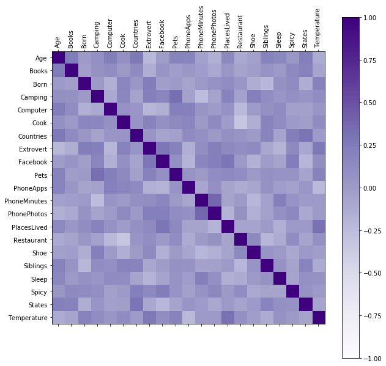

```python
# Run this cell first.  Do NOT edit this cell.
Answer1 = Answer2 = Answer3 = Answer4 = Answer5 = None
import pandas
import numpy
import matplotlib
import matplotlib.pyplot as plt
#%matplotlib inline
table = pandas.read_csv('Counties2010.csv')
table.shape
```


    (3146, 9)


```python
import pandas as pd
import numpy as np
import matplotlib
import matplotlib.pyplot as plt
```

What does the data look like? Use pandas to create a scatterplot that maps PercentCollegeGrad to X, IncomePerCapita to Y, and Population to Size of the county dots.


```python
# Problem 1
# Pandas scatterplot

# x: PercentCollege Grad, y: IncomePerCapita
# s: dot size mapped from Population, had to scale to fit figure
# alpha: adjust transparency to see the overlapping dots better
Answer1 = table.plot.scatter(x="PercentCollegeGrad", y="IncomePerCapita", 
                             s=table.Population/10000+10, alpha=0.5,
                             colormap=plt.cm.terrain, c=table.Population)
```


How correlated are PercentCollegeGrad and IncomePerCapita?  First, filter out the broken counties that have 0 IncomePerCapita Then, compute the Pearson correlation coefficient r between PercentCollegeGrad and IncomePerCapita, which is defined as


https://en.wikipedia.org/wiki/Pearson_correlation_coefficient#For_a_sample


```python
# Filter out broken counties that have 0 IncomePerCapita
newtable = table[table.IncomePerCapita!=0]

# map x and y
x = newtable.PercentCollegeGrad
y = newtable.IncomePerCapita

# calculate xbar and ybar (means)
xbar = x.mean()
ybar = y.mean()

# calculate (xi - xbar) and (yi-ybar), still series objects
xdiff = x - xbar
ydiff = y - ybar

# calculate covariance (numerator)
numerator = (xdiff * ydiff).sum()

# calculate z-scores (denominator)
denominator = np.sqrt( ((xdiff)**2).sum()) *  np.sqrt( ((ydiff)**2).sum()) 

# calculate r 
r = numerator / denominator

Answer2 = r
```

What are the linear regression parameters? Given the potential for correlation, fit a linear regression model to the filtered data (to predict IncomePerCapita based on PercentCollegeGrad) as follows: 

> IncomePerCapita = m * PercentCollegeGrad + b
    
Hint: use the numpy.polyfit() method with degree 1, 
https://docs.scipy.org/doc/numpy/reference/generated/numpy.polyfit.html .


```python
# Problem 3
# Get linear regression parameters, m and b

# map x and y
x = newtable.PercentCollegeGrad
y = newtable.IncomePerCapita

# use numpy.plotfit() w/ degree 1
fit = np.polyfit(x, y, deg=1) # returns coefficients in descending order; c_1, c_0; m, b
m = fit[0]
b = fit[1]

Answer3 = (m,b) 
```

What is the regression error of each county?  Armed with the regression line from Problem 3, compute a new data column (called "Error") that represents an error measure for each county (in the filtered data). It should measure the distance of each county to the regression line, in the IncomePerCapita dimension. Positive error means the county's IncomePerCapita is greater than the line, negative means less than the line.


```python
# Problem 4
# Regression error of each county

# regression line from problem 3
#plt.plot(x, m*x+b)

# new "Error" column - distance of each county to regression line
# IncomePerCapita - regression line
# x: PercentCollegeGrad, y: IncomePerCapita

newtable["Error"] = newtable.IncomePerCapita - ((m*newtable.PercentCollegeGrad) + b)
newtable

# concatenate Name, State, Error series into one dataframe.
name_state_error = pd.concat([newtable.Name, newtable.State, newtable.Error], axis=1)

# sorted by Error (from positive to negative)
Answer4 = name_state_error.sort_values('Error', ascending=False)
```

    C:\Users\coolt\Anaconda3\lib\site-packages\ipykernel_launcher.py:11: SettingWithCopyWarning: 
    A value is trying to be set on a copy of a slice from a DataFrame.
    Try using .loc[row_indexer,col_indexer] = value instead
    
    See the caveats in the documentation: http://pandas.pydata.org/pandas-docs/stable/indexing.html#indexing-view-versus-copy
      # This is added back by InteractiveShellApp.init_path()
    

What does the regression and error look like, and where does Blacksburg fit in?  Use pandas to draw a scatterplot of the above results on the filtered data.


```python
# Problem 5
# Visualize Regression and Error

# use pandas to draw a scatterplot of the above results on the filtered data
# use linear colormap
# map absolute value of Error to the color of the dots
abs_Error = abs(newtable.Error)

plot = newtable.plot.scatter(x="PercentCollegeGrad", y="IncomePerCapita",
                     c=abs_Error, colormap=plt.cm.copper, alpha=0.5, figsize=(10,9), sharex=False)

# label axes
#plot.set_xlabel("Percent College Grad")
#plot.set_ylabel("Income Per Capita")

# add regression line
x = newtable.PercentCollegeGrad
y = newtable.IncomePerCapita
m, b = np.polyfit(x, y, 1)

import matplotlib.lines as lines
line = lines.Line2D(x, m*x+b, c='salmon') # or, plot.plot(x, m*x+b, c='salmon')
plot.add_line(line)

# use Axes.annotate() to label 'Montgomery, VA' and have an arrow pointing to its dot
plot.annotate('Montgomery, VA', xy=(39.6,25545), xytext=(34,10000),
              arrowprops=dict(facecolor ='salmon', shrink = 0.05))

Answer5 = plot
```




