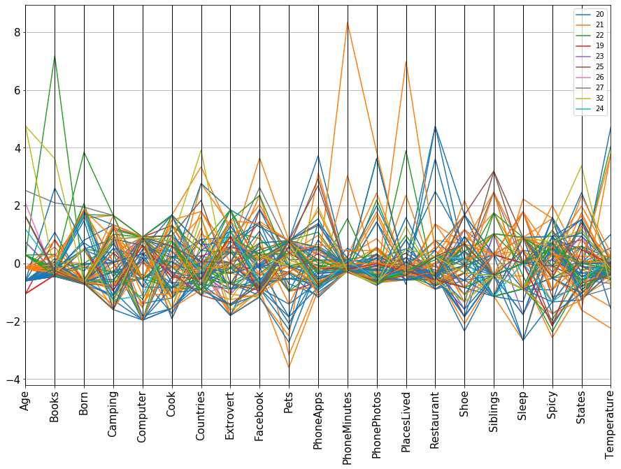
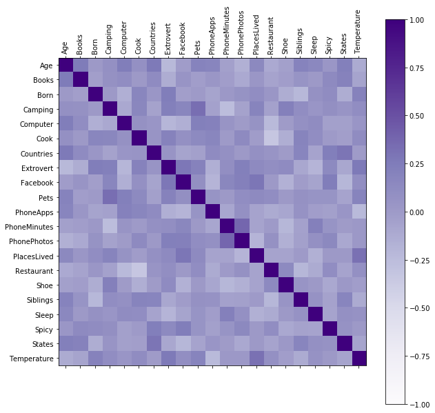

```python
# Run this cell first.  Do NOT edit this cell.
Answer0 = Answer1 = Answer2 = Answer3 = Answer4 = Answer5 = None
import pandas
import numpy
import matplotlib
import matplotlib.pyplot as plt
#%matplotlib inline
table = pandas.read_csv('Survey-3654-Fall2020-clean-HW05.csv')
table.shape
```


    (87, 22)


```python
import pandas as pd 
import numpy as np
import matplotlib
import matplotlib.pyplot as plt
```

First normalize each quantitative column in the above student survey table using z-scores https://en.wikipedia.org/wiki/Standard_score. 


```python
# Problem 0
# only want quantitative columns, exclude 'Name' column
quanttable = table.iloc[:,1:] # starting from row 0, column 1

# normalize each column -- z = (x - mean)/stdev
ztable = (quanttable - quanttable.mean()) / quanttable.std()

# reorder columns into alphabetical order by column
Answer0 = ztable.sort_index(axis=1) # 0 = sort rows, 1 = sort columns
Answer0

#Answer0.describe()
```


<div>
<style scoped>
    .dataframe tbody tr th:only-of-type {
        vertical-align: middle;
    }

    .dataframe tbody tr th {
        vertical-align: top;
    }

    .dataframe thead th {
        text-align: right;
    }
</style>
<table border="1" class="dataframe">
  <thead>
    <tr style="text-align: right;">
      <th></th>
      <th>Age</th>
      <th>Books</th>
      <th>Born</th>
      <th>Camping</th>
      <th>Computer</th>
      <th>Cook</th>
      <th>Countries</th>
      <th>Extrovert</th>
      <th>Facebook</th>
      <th>Pets</th>
      <th>...</th>
      <th>PhoneMinutes</th>
      <th>PhonePhotos</th>
      <th>PlacesLived</th>
      <th>Restaurant</th>
      <th>Shoe</th>
      <th>Siblings</th>
      <th>Sleep</th>
      <th>Spicy</th>
      <th>States</th>
      <th>Temperature</th>
    </tr>
  </thead>
  <tbody>
    <tr>
      <th>0</th>
      <td>-0.600271</td>
      <td>-0.397329</td>
      <td>2.626920e-11</td>
      <td>0.003366</td>
      <td>-1.384840</td>
      <td>-1.193199</td>
      <td>0.062112</td>
      <td>0.393429</td>
      <td>0.353636</td>
      <td>0.792453</td>
      <td>...</td>
      <td>-0.280623</td>
      <td>-0.684402</td>
      <td>0.046061</td>
      <td>4.744672</td>
      <td>1.678143</td>
      <td>-0.414582</td>
      <td>-0.878088</td>
      <td>0.320506</td>
      <td>0.014666</td>
      <td>1.009463</td>
    </tr>
    <tr>
      <th>1</th>
      <td>-0.153916</td>
      <td>0.060858</td>
      <td>2.626920e-11</td>
      <td>-1.591015</td>
      <td>0.912225</td>
      <td>0.958269</td>
      <td>-0.130879</td>
      <td>-1.798355</td>
      <td>-0.910388</td>
      <td>-3.601645</td>
      <td>...</td>
      <td>0.138018</td>
      <td>-0.647760</td>
      <td>-0.416322</td>
      <td>-0.889869</td>
      <td>-0.077852</td>
      <td>-1.135954</td>
      <td>0.898509</td>
      <td>-0.504465</td>
      <td>-1.145297</td>
      <td>-0.384089</td>
    </tr>
    <tr>
      <th>2</th>
      <td>-0.153916</td>
      <td>0.264496</td>
      <td>1.564373e+00</td>
      <td>1.662824</td>
      <td>0.912225</td>
      <td>-1.910355</td>
      <td>0.255104</td>
      <td>-1.798355</td>
      <td>-0.222759</td>
      <td>0.792453</td>
      <td>...</td>
      <td>0.249655</td>
      <td>2.439529</td>
      <td>-0.262195</td>
      <td>0.800493</td>
      <td>0.674717</td>
      <td>-1.135954</td>
      <td>2.230956</td>
      <td>1.557961</td>
      <td>-1.261293</td>
      <td>0.359139</td>
    </tr>
    <tr>
      <th>3</th>
      <td>-0.153916</td>
      <td>-0.448239</td>
      <td>-7.113887e-01</td>
      <td>0.849364</td>
      <td>0.050826</td>
      <td>-1.193199</td>
      <td>1.220062</td>
      <td>-1.798355</td>
      <td>-1.137913</td>
      <td>0.353043</td>
      <td>...</td>
      <td>-0.252713</td>
      <td>-0.642934</td>
      <td>-0.570450</td>
      <td>0.011658</td>
      <td>1.176430</td>
      <td>-0.414582</td>
      <td>-0.433939</td>
      <td>-2.566891</td>
      <td>-0.913304</td>
      <td>-1.498930</td>
    </tr>
    <tr>
      <th>4</th>
      <td>-0.600271</td>
      <td>-0.193691</td>
      <td>-6.334369e-01</td>
      <td>0.035904</td>
      <td>0.912225</td>
      <td>0.958269</td>
      <td>0.062112</td>
      <td>1.854619</td>
      <td>-0.151974</td>
      <td>0.792453</td>
      <td>...</td>
      <td>-0.280623</td>
      <td>1.436615</td>
      <td>-0.262195</td>
      <td>-0.551796</td>
      <td>0.423861</td>
      <td>-1.135954</td>
      <td>-1.322237</td>
      <td>1.599210</td>
      <td>-0.101330</td>
      <td>-0.198282</td>
    </tr>
    <tr>
      <th>5</th>
      <td>-0.600271</td>
      <td>-0.448239</td>
      <td>-5.857282e-01</td>
      <td>-1.200555</td>
      <td>0.050826</td>
      <td>-0.691190</td>
      <td>-0.902846</td>
      <td>0.539548</td>
      <td>-0.905332</td>
      <td>-0.350013</td>
      <td>...</td>
      <td>-0.252713</td>
      <td>-0.753076</td>
      <td>0.046061</td>
      <td>0.462421</td>
      <td>1.678143</td>
      <td>-0.414582</td>
      <td>0.010210</td>
      <td>-2.154406</td>
      <td>-0.565315</td>
      <td>-0.291185</td>
    </tr>
    <tr>
      <th>6</th>
      <td>0.292440</td>
      <td>7.188208</td>
      <td>-6.086782e-01</td>
      <td>-0.289480</td>
      <td>0.912225</td>
      <td>-1.193199</td>
      <td>-0.323871</td>
      <td>-0.702463</td>
      <td>-0.050852</td>
      <td>0.353043</td>
      <td>...</td>
      <td>-0.271319</td>
      <td>-0.728941</td>
      <td>-0.262195</td>
      <td>-0.326415</td>
      <td>0.423861</td>
      <td>-0.414582</td>
      <td>0.010210</td>
      <td>-0.091979</td>
      <td>0.014666</td>
      <td>-0.012475</td>
    </tr>
    <tr>
      <th>7</th>
      <td>-0.153916</td>
      <td>0.060858</td>
      <td>-6.570529e-01</td>
      <td>0.035904</td>
      <td>-1.959106</td>
      <td>-0.476043</td>
      <td>-0.130879</td>
      <td>-0.702463</td>
      <td>1.015985</td>
      <td>-3.162235</td>
      <td>...</td>
      <td>-0.289926</td>
      <td>-0.306362</td>
      <td>-0.416322</td>
      <td>0.575112</td>
      <td>0.423861</td>
      <td>-0.414582</td>
      <td>0.898509</td>
      <td>0.320506</td>
      <td>-0.913304</td>
      <td>-0.291185</td>
    </tr>
    <tr>
      <th>8</th>
      <td>-0.600271</td>
      <td>0.060858</td>
      <td>-6.571696e-01</td>
      <td>0.361288</td>
      <td>-0.523440</td>
      <td>0.061824</td>
      <td>-0.709854</td>
      <td>-0.154517</td>
      <td>-0.141861</td>
      <td>0.792453</td>
      <td>...</td>
      <td>-0.238759</td>
      <td>0.048202</td>
      <td>-0.416322</td>
      <td>-0.326415</td>
      <td>-1.833847</td>
      <td>1.028163</td>
      <td>0.898509</td>
      <td>-0.298222</td>
      <td>0.594648</td>
      <td>-0.198282</td>
    </tr>
    <tr>
      <th>9</th>
      <td>-0.153916</td>
      <td>-0.142781</td>
      <td>-6.448640e-01</td>
      <td>1.662824</td>
      <td>-0.523440</td>
      <td>-0.117465</td>
      <td>-0.516862</td>
      <td>0.028132</td>
      <td>1.453338</td>
      <td>0.792453</td>
      <td>...</td>
      <td>-0.260156</td>
      <td>-0.667068</td>
      <td>-0.570450</td>
      <td>-0.439106</td>
      <td>0.173004</td>
      <td>1.028163</td>
      <td>0.898509</td>
      <td>1.557961</td>
      <td>-1.609282</td>
      <td>-2.242157</td>
    </tr>
    <tr>
      <th>10</th>
      <td>-0.600271</td>
      <td>-0.193691</td>
      <td>1.836452e+00</td>
      <td>0.035904</td>
      <td>-1.959106</td>
      <td>0.599691</td>
      <td>-0.516862</td>
      <td>0.576078</td>
      <td>1.380024</td>
      <td>0.133338</td>
      <td>...</td>
      <td>-0.294577</td>
      <td>-0.069401</td>
      <td>-0.108067</td>
      <td>-0.326415</td>
      <td>-1.833847</td>
      <td>-0.414582</td>
      <td>0.010210</td>
      <td>-0.091979</td>
      <td>0.014666</td>
      <td>0.544946</td>
    </tr>
    <tr>
      <th>11</th>
      <td>-0.153916</td>
      <td>-0.346420</td>
      <td>2.053709e+00</td>
      <td>-0.777556</td>
      <td>0.194392</td>
      <td>-1.013910</td>
      <td>-0.516862</td>
      <td>0.028132</td>
      <td>-0.675280</td>
      <td>0.353043</td>
      <td>...</td>
      <td>-0.252713</td>
      <td>0.044252</td>
      <td>-0.108067</td>
      <td>-0.439106</td>
      <td>0.674717</td>
      <td>0.306791</td>
      <td>0.010210</td>
      <td>-0.504465</td>
      <td>-1.145297</td>
      <td>-0.012475</td>
    </tr>
    <tr>
      <th>12</th>
      <td>-0.153916</td>
      <td>-0.346420</td>
      <td>-7.508086e-02</td>
      <td>-0.289480</td>
      <td>-1.528406</td>
      <td>1.675425</td>
      <td>3.342969</td>
      <td>1.124024</td>
      <td>-0.149446</td>
      <td>-0.306072</td>
      <td>...</td>
      <td>0.249655</td>
      <td>0.860669</td>
      <td>-0.262195</td>
      <td>-0.326415</td>
      <td>-0.579565</td>
      <td>2.470908</td>
      <td>-0.878088</td>
      <td>0.526748</td>
      <td>1.986603</td>
      <td>0.173332</td>
    </tr>
    <tr>
      <th>13</th>
      <td>-1.046626</td>
      <td>-0.397329</td>
      <td>-6.387695e-01</td>
      <td>-0.289480</td>
      <td>0.912225</td>
      <td>1.316847</td>
      <td>-0.323871</td>
      <td>-1.067760</td>
      <td>1.870466</td>
      <td>0.353043</td>
      <td>...</td>
      <td>-0.280623</td>
      <td>0.558983</td>
      <td>-0.570450</td>
      <td>0.011658</td>
      <td>-1.833847</td>
      <td>-0.414582</td>
      <td>0.010210</td>
      <td>-0.091979</td>
      <td>-0.565315</td>
      <td>-0.105378</td>
    </tr>
    <tr>
      <th>14</th>
      <td>-0.600271</td>
      <td>-0.448239</td>
      <td>-7.193305e-01</td>
      <td>-1.102939</td>
      <td>0.912225</td>
      <td>-1.910355</td>
      <td>0.255104</td>
      <td>0.028132</td>
      <td>-0.799154</td>
      <td>0.572748</td>
      <td>...</td>
      <td>-0.289926</td>
      <td>1.436615</td>
      <td>-0.724578</td>
      <td>4.744672</td>
      <td>0.173004</td>
      <td>-0.414582</td>
      <td>-1.766386</td>
      <td>0.939234</td>
      <td>-0.797308</td>
      <td>-0.384089</td>
    </tr>
    <tr>
      <th>15</th>
      <td>-0.600271</td>
      <td>-0.295510</td>
      <td>8.042810e-01</td>
      <td>1.337440</td>
      <td>-1.959106</td>
      <td>-1.551777</td>
      <td>-0.323871</td>
      <td>1.124024</td>
      <td>-0.844659</td>
      <td>-1.404596</td>
      <td>...</td>
      <td>-0.289926</td>
      <td>-0.099241</td>
      <td>0.354317</td>
      <td>2.490856</td>
      <td>0.674717</td>
      <td>-1.135954</td>
      <td>-0.878088</td>
      <td>0.320506</td>
      <td>0.594648</td>
      <td>0.173332</td>
    </tr>
    <tr>
      <th>16</th>
      <td>-0.153916</td>
      <td>-0.448239</td>
      <td>1.807960e+00</td>
      <td>-1.591015</td>
      <td>0.912225</td>
      <td>-0.655332</td>
      <td>1.799036</td>
      <td>0.393429</td>
      <td>-0.404779</td>
      <td>-0.306072</td>
      <td>...</td>
      <td>3.040589</td>
      <td>-0.318648</td>
      <td>-0.262195</td>
      <td>0.237039</td>
      <td>0.423861</td>
      <td>-0.414582</td>
      <td>0.010210</td>
      <td>0.320506</td>
      <td>-1.145297</td>
      <td>-0.542024</td>
    </tr>
    <tr>
      <th>17</th>
      <td>-0.153916</td>
      <td>-0.448239</td>
      <td>-5.690643e-01</td>
      <td>1.174748</td>
      <td>0.912225</td>
      <td>-1.013910</td>
      <td>-0.709854</td>
      <td>0.941375</td>
      <td>0.100831</td>
      <td>0.572748</td>
      <td>...</td>
      <td>-0.252713</td>
      <td>-0.538056</td>
      <td>0.200189</td>
      <td>-0.664487</td>
      <td>-0.328708</td>
      <td>-1.135954</td>
      <td>-2.654685</td>
      <td>0.526748</td>
      <td>-0.797308</td>
      <td>-0.021765</td>
    </tr>
    <tr>
      <th>18</th>
      <td>-0.153916</td>
      <td>0.569954</td>
      <td>-6.366746e-01</td>
      <td>1.012056</td>
      <td>-0.810574</td>
      <td>-0.117465</td>
      <td>0.834079</td>
      <td>-0.337165</td>
      <td>0.007294</td>
      <td>0.792453</td>
      <td>...</td>
      <td>-0.215501</td>
      <td>-0.633499</td>
      <td>-0.570450</td>
      <td>1.363948</td>
      <td>-0.077852</td>
      <td>2.470908</td>
      <td>-0.878088</td>
      <td>-0.504465</td>
      <td>1.290625</td>
      <td>0.173332</td>
    </tr>
    <tr>
      <th>19</th>
      <td>0.738795</td>
      <td>-0.295510</td>
      <td>-6.576826e-01</td>
      <td>0.035904</td>
      <td>0.912225</td>
      <td>0.241113</td>
      <td>-0.130879</td>
      <td>-1.615706</td>
      <td>-0.948309</td>
      <td>0.792453</td>
      <td>...</td>
      <td>0.026380</td>
      <td>-0.432082</td>
      <td>-0.570450</td>
      <td>0.011658</td>
      <td>-1.582991</td>
      <td>1.028163</td>
      <td>-1.766386</td>
      <td>0.196760</td>
      <td>-0.565315</td>
      <td>-0.690670</td>
    </tr>
    <tr>
      <th>20</th>
      <td>-0.153916</td>
      <td>-0.397329</td>
      <td>-6.432452e-01</td>
      <td>-1.428323</td>
      <td>0.194392</td>
      <td>-1.731066</td>
      <td>0.641087</td>
      <td>-0.154517</td>
      <td>-0.531181</td>
      <td>-0.086367</td>
      <td>...</td>
      <td>-0.141076</td>
      <td>-0.384471</td>
      <td>-0.416322</td>
      <td>-0.439106</td>
      <td>0.925574</td>
      <td>0.306791</td>
      <td>1.786807</td>
      <td>-0.504465</td>
      <td>1.754611</td>
      <td>-0.291185</td>
    </tr>
    <tr>
      <th>21</th>
      <td>-0.600271</td>
      <td>1.079050</td>
      <td>-7.193305e-01</td>
      <td>0.361288</td>
      <td>0.912225</td>
      <td>0.958269</td>
      <td>0.062112</td>
      <td>-0.702463</td>
      <td>-1.105048</td>
      <td>0.792453</td>
      <td>...</td>
      <td>-0.215501</td>
      <td>-0.713583</td>
      <td>0.200189</td>
      <td>-0.101033</td>
      <td>-0.579565</td>
      <td>-1.135954</td>
      <td>-0.878088</td>
      <td>-0.916950</td>
      <td>0.594648</td>
      <td>-0.105378</td>
    </tr>
    <tr>
      <th>22</th>
      <td>-0.153916</td>
      <td>0.060858</td>
      <td>-5.092626e-01</td>
      <td>-0.940247</td>
      <td>0.912225</td>
      <td>0.599691</td>
      <td>1.606045</td>
      <td>-1.067760</td>
      <td>-1.163193</td>
      <td>-2.503121</td>
      <td>...</td>
      <td>-0.289926</td>
      <td>-0.576892</td>
      <td>-0.108067</td>
      <td>-0.777178</td>
      <td>0.674717</td>
      <td>1.749536</td>
      <td>0.010210</td>
      <td>0.320506</td>
      <td>-0.217326</td>
      <td>-0.569895</td>
    </tr>
    <tr>
      <th>23</th>
      <td>-0.600271</td>
      <td>-0.397329</td>
      <td>-5.207905e-01</td>
      <td>-0.777556</td>
      <td>-0.523440</td>
      <td>-1.731066</td>
      <td>-0.130879</td>
      <td>-0.154517</td>
      <td>1.112051</td>
      <td>-0.701540</td>
      <td>...</td>
      <td>-0.196895</td>
      <td>-0.713583</td>
      <td>0.508445</td>
      <td>-0.326415</td>
      <td>0.925574</td>
      <td>-0.414582</td>
      <td>-0.878088</td>
      <td>0.526748</td>
      <td>-0.913304</td>
      <td>-0.105378</td>
    </tr>
    <tr>
      <th>24</th>
      <td>1.631506</td>
      <td>-0.295510</td>
      <td>-6.637663e-01</td>
      <td>1.239825</td>
      <td>0.912225</td>
      <td>-0.368470</td>
      <td>-1.095837</td>
      <td>0.028132</td>
      <td>0.472455</td>
      <td>0.792453</td>
      <td>...</td>
      <td>-0.299229</td>
      <td>-0.054042</td>
      <td>0.354317</td>
      <td>-0.326415</td>
      <td>-0.077852</td>
      <td>0.306791</td>
      <td>1.786807</td>
      <td>-1.164441</td>
      <td>-0.797308</td>
      <td>-0.384089</td>
    </tr>
    <tr>
      <th>25</th>
      <td>2.077861</td>
      <td>-0.448239</td>
      <td>-6.713367e-01</td>
      <td>1.337440</td>
      <td>0.050826</td>
      <td>-0.117465</td>
      <td>-1.095837</td>
      <td>-0.702463</td>
      <td>-0.933141</td>
      <td>0.792453</td>
      <td>...</td>
      <td>-0.280623</td>
      <td>-0.531035</td>
      <td>-0.416322</td>
      <td>0.237039</td>
      <td>-0.830421</td>
      <td>-1.135954</td>
      <td>0.898509</td>
      <td>-0.091979</td>
      <td>0.942637</td>
      <td>-0.569895</td>
    </tr>
    <tr>
      <th>26</th>
      <td>-0.600271</td>
      <td>0.060858</td>
      <td>-6.588050e-01</td>
      <td>0.784288</td>
      <td>-1.815540</td>
      <td>-1.551777</td>
      <td>-0.709854</td>
      <td>0.941375</td>
      <td>-0.718257</td>
      <td>0.792453</td>
      <td>...</td>
      <td>-0.196895</td>
      <td>-0.181957</td>
      <td>0.046061</td>
      <td>-0.439106</td>
      <td>0.925574</td>
      <td>-0.414582</td>
      <td>-0.878088</td>
      <td>0.939234</td>
      <td>-0.101330</td>
      <td>-0.384089</td>
    </tr>
    <tr>
      <th>27</th>
      <td>-0.600271</td>
      <td>-0.346420</td>
      <td>-6.503680e-01</td>
      <td>-0.289480</td>
      <td>-0.523440</td>
      <td>-0.117465</td>
      <td>-0.130879</td>
      <td>-0.337165</td>
      <td>-0.091300</td>
      <td>-0.306072</td>
      <td>...</td>
      <td>-0.122470</td>
      <td>-0.647760</td>
      <td>-0.262195</td>
      <td>0.011658</td>
      <td>0.173004</td>
      <td>-0.414582</td>
      <td>0.010210</td>
      <td>-0.091979</td>
      <td>-0.565315</td>
      <td>-0.291185</td>
    </tr>
    <tr>
      <th>28</th>
      <td>-1.046626</td>
      <td>0.824502</td>
      <td>-6.399123e-01</td>
      <td>0.361288</td>
      <td>-0.523440</td>
      <td>0.241113</td>
      <td>0.255104</td>
      <td>0.576078</td>
      <td>0.361220</td>
      <td>-0.965186</td>
      <td>...</td>
      <td>-0.224804</td>
      <td>0.286040</td>
      <td>-0.570450</td>
      <td>-0.551796</td>
      <td>1.678143</td>
      <td>0.306791</td>
      <td>0.010210</td>
      <td>0.526748</td>
      <td>0.826640</td>
      <td>-0.384089</td>
    </tr>
    <tr>
      <th>29</th>
      <td>0.292440</td>
      <td>-0.193691</td>
      <td>1.690935e+00</td>
      <td>1.662824</td>
      <td>-0.523440</td>
      <td>1.675425</td>
      <td>-0.323871</td>
      <td>1.854619</td>
      <td>0.164033</td>
      <td>0.792453</td>
      <td>...</td>
      <td>0.156624</td>
      <td>-0.603001</td>
      <td>3.899258</td>
      <td>-0.777178</td>
      <td>-0.077852</td>
      <td>-1.135954</td>
      <td>-0.878088</td>
      <td>-0.504465</td>
      <td>-1.029300</td>
      <td>0.080429</td>
    </tr>
    <tr>
      <th>...</th>
      <td>...</td>
      <td>...</td>
      <td>...</td>
      <td>...</td>
      <td>...</td>
      <td>...</td>
      <td>...</td>
      <td>...</td>
      <td>...</td>
      <td>...</td>
      <td>...</td>
      <td>...</td>
      <td>...</td>
      <td>...</td>
      <td>...</td>
      <td>...</td>
      <td>...</td>
      <td>...</td>
      <td>...</td>
      <td>...</td>
      <td>...</td>
    </tr>
    <tr>
      <th>57</th>
      <td>-0.600271</td>
      <td>-0.448239</td>
      <td>-6.412454e-01</td>
      <td>0.523980</td>
      <td>-0.810574</td>
      <td>-0.834621</td>
      <td>-0.516862</td>
      <td>0.393429</td>
      <td>-0.657583</td>
      <td>-0.525777</td>
      <td>...</td>
      <td>-0.243410</td>
      <td>-0.559997</td>
      <td>-0.570450</td>
      <td>-0.326415</td>
      <td>0.423861</td>
      <td>-0.414582</td>
      <td>-0.878088</td>
      <td>0.732991</td>
      <td>-0.449319</td>
      <td>-0.012475</td>
    </tr>
    <tr>
      <th>58</th>
      <td>-0.600271</td>
      <td>-0.295510</td>
      <td>-6.571214e-01</td>
      <td>-1.591015</td>
      <td>0.912225</td>
      <td>-0.655332</td>
      <td>-0.709854</td>
      <td>-1.798355</td>
      <td>0.277795</td>
      <td>-0.086367</td>
      <td>...</td>
      <td>-0.302950</td>
      <td>-0.252826</td>
      <td>-0.262195</td>
      <td>0.237039</td>
      <td>-0.328708</td>
      <td>-0.414582</td>
      <td>0.010210</td>
      <td>0.732991</td>
      <td>-0.913304</td>
      <td>-0.012475</td>
    </tr>
    <tr>
      <th>59</th>
      <td>-0.600271</td>
      <td>0.162677</td>
      <td>-2.589646e-01</td>
      <td>1.012056</td>
      <td>-1.959106</td>
      <td>-1.551777</td>
      <td>-0.516862</td>
      <td>0.028132</td>
      <td>1.870466</td>
      <td>-0.174249</td>
      <td>...</td>
      <td>-0.266668</td>
      <td>0.190159</td>
      <td>0.046061</td>
      <td>-0.326415</td>
      <td>0.173004</td>
      <td>0.306791</td>
      <td>-2.654685</td>
      <td>0.732991</td>
      <td>1.522618</td>
      <td>-1.571188</td>
    </tr>
    <tr>
      <th>60</th>
      <td>-0.153916</td>
      <td>-0.142781</td>
      <td>-6.586749e-01</td>
      <td>-1.591015</td>
      <td>0.050826</td>
      <td>-0.117465</td>
      <td>0.062112</td>
      <td>0.758727</td>
      <td>2.037317</td>
      <td>0.133338</td>
      <td>...</td>
      <td>8.343364</td>
      <td>3.854930</td>
      <td>-0.416322</td>
      <td>-0.326415</td>
      <td>-2.084703</td>
      <td>-0.414582</td>
      <td>1.786807</td>
      <td>0.320506</td>
      <td>0.246659</td>
      <td>0.266235</td>
    </tr>
    <tr>
      <th>61</th>
      <td>-0.600271</td>
      <td>-0.193691</td>
      <td>-5.566563e-01</td>
      <td>0.849364</td>
      <td>0.625092</td>
      <td>-1.013910</td>
      <td>-0.902846</td>
      <td>-1.433057</td>
      <td>-1.059543</td>
      <td>0.792453</td>
      <td>...</td>
      <td>0.110108</td>
      <td>0.017485</td>
      <td>-0.108067</td>
      <td>-0.551796</td>
      <td>1.678143</td>
      <td>0.306791</td>
      <td>0.898509</td>
      <td>0.939234</td>
      <td>0.942637</td>
      <td>-0.012475</td>
    </tr>
    <tr>
      <th>62</th>
      <td>-0.600271</td>
      <td>-0.448239</td>
      <td>4.953688e-01</td>
      <td>0.849364</td>
      <td>0.912225</td>
      <td>0.778980</td>
      <td>-0.709854</td>
      <td>-0.885111</td>
      <td>-0.055908</td>
      <td>0.792453</td>
      <td>...</td>
      <td>-0.029438</td>
      <td>-0.481010</td>
      <td>-0.108067</td>
      <td>0.800493</td>
      <td>-0.077852</td>
      <td>-1.135954</td>
      <td>0.898509</td>
      <td>-0.504465</td>
      <td>-0.333323</td>
      <td>-0.198282</td>
    </tr>
    <tr>
      <th>63</th>
      <td>-0.600271</td>
      <td>-0.193691</td>
      <td>1.846050e+00</td>
      <td>-0.940247</td>
      <td>-1.959106</td>
      <td>-0.476043</td>
      <td>0.834079</td>
      <td>-0.885111</td>
      <td>-0.536237</td>
      <td>-2.063711</td>
      <td>...</td>
      <td>-0.280623</td>
      <td>-0.376572</td>
      <td>-0.262195</td>
      <td>-0.326415</td>
      <td>-1.332134</td>
      <td>-0.414582</td>
      <td>0.010210</td>
      <td>0.526748</td>
      <td>-0.449319</td>
      <td>-0.384089</td>
    </tr>
    <tr>
      <th>64</th>
      <td>-0.600271</td>
      <td>0.060858</td>
      <td>-6.418168e-01</td>
      <td>-1.102939</td>
      <td>0.481526</td>
      <td>1.675425</td>
      <td>0.641087</td>
      <td>0.758727</td>
      <td>0.100831</td>
      <td>0.792453</td>
      <td>...</td>
      <td>-0.215501</td>
      <td>3.630695</td>
      <td>-0.262195</td>
      <td>-0.213724</td>
      <td>-0.579565</td>
      <td>-0.414582</td>
      <td>-0.878088</td>
      <td>1.557961</td>
      <td>-0.333323</td>
      <td>-0.384089</td>
    </tr>
    <tr>
      <th>65</th>
      <td>-0.153916</td>
      <td>-0.040962</td>
      <td>1.864524e+00</td>
      <td>0.849364</td>
      <td>-1.959106</td>
      <td>0.420402</td>
      <td>-0.323871</td>
      <td>0.028132</td>
      <td>0.677227</td>
      <td>-1.404596</td>
      <td>...</td>
      <td>0.026380</td>
      <td>1.783938</td>
      <td>-0.262195</td>
      <td>-0.101033</td>
      <td>-1.081278</td>
      <td>-0.414582</td>
      <td>0.898509</td>
      <td>0.732991</td>
      <td>0.130662</td>
      <td>-0.105378</td>
    </tr>
    <tr>
      <th>66</th>
      <td>-0.600271</td>
      <td>-0.040962</td>
      <td>-5.768538e-01</td>
      <td>-0.549787</td>
      <td>0.596379</td>
      <td>0.205255</td>
      <td>0.834079</td>
      <td>0.904846</td>
      <td>-0.184838</td>
      <td>0.353043</td>
      <td>...</td>
      <td>0.026380</td>
      <td>1.995448</td>
      <td>-0.108067</td>
      <td>-0.326415</td>
      <td>-0.077852</td>
      <td>0.306791</td>
      <td>0.010210</td>
      <td>0.856737</td>
      <td>0.478651</td>
      <td>-0.031056</td>
    </tr>
    <tr>
      <th>67</th>
      <td>-0.600271</td>
      <td>-0.397329</td>
      <td>-6.541961e-01</td>
      <td>0.523980</td>
      <td>0.194392</td>
      <td>0.061824</td>
      <td>-0.516862</td>
      <td>1.306673</td>
      <td>-0.151974</td>
      <td>-1.844006</td>
      <td>...</td>
      <td>-0.280623</td>
      <td>0.339575</td>
      <td>-0.416322</td>
      <td>-0.551796</td>
      <td>0.925574</td>
      <td>-0.414582</td>
      <td>0.010210</td>
      <td>0.526748</td>
      <td>0.014666</td>
      <td>0.033977</td>
    </tr>
    <tr>
      <th>68</th>
      <td>0.292440</td>
      <td>-0.295510</td>
      <td>-6.538482e-01</td>
      <td>-0.614864</td>
      <td>-0.523440</td>
      <td>-0.834621</td>
      <td>-0.323871</td>
      <td>-0.337165</td>
      <td>0.606441</td>
      <td>-0.965186</td>
      <td>...</td>
      <td>-0.303880</td>
      <td>-0.541128</td>
      <td>-0.262195</td>
      <td>0.237039</td>
      <td>0.674717</td>
      <td>-0.414582</td>
      <td>-0.878088</td>
      <td>0.732991</td>
      <td>-0.565315</td>
      <td>-0.105378</td>
    </tr>
    <tr>
      <th>69</th>
      <td>1.631506</td>
      <td>-0.244600</td>
      <td>-6.940197e-01</td>
      <td>-0.777556</td>
      <td>0.912225</td>
      <td>0.958269</td>
      <td>2.185020</td>
      <td>-0.702463</td>
      <td>-0.935669</td>
      <td>0.572748</td>
      <td>...</td>
      <td>-0.299229</td>
      <td>-0.178666</td>
      <td>0.200189</td>
      <td>-0.777178</td>
      <td>-0.328708</td>
      <td>3.192281</td>
      <td>0.010210</td>
      <td>1.145476</td>
      <td>-0.101330</td>
      <td>-0.569895</td>
    </tr>
    <tr>
      <th>70</th>
      <td>0.292440</td>
      <td>-0.397329</td>
      <td>-1.321687e-01</td>
      <td>-0.289480</td>
      <td>-1.241273</td>
      <td>0.778980</td>
      <td>-0.709854</td>
      <td>0.941375</td>
      <td>0.325828</td>
      <td>0.353043</td>
      <td>...</td>
      <td>-0.187591</td>
      <td>-0.372623</td>
      <td>0.970828</td>
      <td>-0.439106</td>
      <td>0.674717</td>
      <td>-0.414582</td>
      <td>0.898509</td>
      <td>-0.504465</td>
      <td>0.014666</td>
      <td>0.173332</td>
    </tr>
    <tr>
      <th>71</th>
      <td>-0.600271</td>
      <td>2.606340</td>
      <td>6.366032e-01</td>
      <td>-1.102939</td>
      <td>0.194392</td>
      <td>-0.834621</td>
      <td>-0.323871</td>
      <td>-0.154517</td>
      <td>-0.874996</td>
      <td>-1.844006</td>
      <td>...</td>
      <td>0.193836</td>
      <td>-0.630647</td>
      <td>-0.108067</td>
      <td>-0.439106</td>
      <td>-1.833847</td>
      <td>-0.414582</td>
      <td>0.898509</td>
      <td>0.939234</td>
      <td>1.522618</td>
      <td>-0.384089</td>
    </tr>
    <tr>
      <th>72</th>
      <td>-0.153916</td>
      <td>-0.346420</td>
      <td>-5.691405e-01</td>
      <td>0.361288</td>
      <td>0.912225</td>
      <td>-1.551777</td>
      <td>1.027070</td>
      <td>0.393429</td>
      <td>3.650213</td>
      <td>0.792453</td>
      <td>...</td>
      <td>-0.252713</td>
      <td>-0.680452</td>
      <td>6.981815</td>
      <td>0.462421</td>
      <td>-1.332134</td>
      <td>-0.414582</td>
      <td>-0.878088</td>
      <td>0.320506</td>
      <td>0.014666</td>
      <td>3.796566</td>
    </tr>
    <tr>
      <th>73</th>
      <td>-0.153916</td>
      <td>-0.040962</td>
      <td>-7.136170e-01</td>
      <td>1.337440</td>
      <td>0.912225</td>
      <td>0.599691</td>
      <td>-0.902846</td>
      <td>0.941375</td>
      <td>0.100831</td>
      <td>0.704571</td>
      <td>...</td>
      <td>-0.029438</td>
      <td>0.023628</td>
      <td>-0.262195</td>
      <td>0.237039</td>
      <td>1.176430</td>
      <td>-0.414582</td>
      <td>0.898509</td>
      <td>-0.916950</td>
      <td>0.014666</td>
      <td>0.080429</td>
    </tr>
    <tr>
      <th>74</th>
      <td>-0.153916</td>
      <td>-0.295510</td>
      <td>-6.574338e-01</td>
      <td>1.337440</td>
      <td>-0.523440</td>
      <td>1.496136</td>
      <td>1.799036</td>
      <td>0.028132</td>
      <td>-0.404779</td>
      <td>0.353043</td>
      <td>...</td>
      <td>0.435717</td>
      <td>0.454765</td>
      <td>-0.416322</td>
      <td>-0.326415</td>
      <td>0.674717</td>
      <td>0.306791</td>
      <td>1.786807</td>
      <td>-0.916950</td>
      <td>0.826640</td>
      <td>-0.291185</td>
    </tr>
    <tr>
      <th>75</th>
      <td>-0.153916</td>
      <td>-0.346420</td>
      <td>-6.488635e-01</td>
      <td>-0.777556</td>
      <td>0.625092</td>
      <td>-1.551777</td>
      <td>-0.902846</td>
      <td>-1.250409</td>
      <td>-1.064599</td>
      <td>-0.306072</td>
      <td>...</td>
      <td>-0.289926</td>
      <td>0.008489</td>
      <td>-0.108067</td>
      <td>-0.664487</td>
      <td>-0.077852</td>
      <td>1.028163</td>
      <td>-0.878088</td>
      <td>-1.741920</td>
      <td>-1.261293</td>
      <td>0.266235</td>
    </tr>
    <tr>
      <th>76</th>
      <td>-1.046626</td>
      <td>-0.397329</td>
      <td>4.953688e-01</td>
      <td>-0.940247</td>
      <td>0.625092</td>
      <td>-0.476043</td>
      <td>-0.516862</td>
      <td>0.941375</td>
      <td>-1.074712</td>
      <td>0.353043</td>
      <td>...</td>
      <td>-0.196895</td>
      <td>-0.007747</td>
      <td>-0.262195</td>
      <td>-0.551796</td>
      <td>-0.830421</td>
      <td>0.306791</td>
      <td>0.010210</td>
      <td>-2.154406</td>
      <td>0.478651</td>
      <td>-0.012475</td>
    </tr>
    <tr>
      <th>77</th>
      <td>-0.600271</td>
      <td>-0.193691</td>
      <td>-6.736222e-01</td>
      <td>0.686672</td>
      <td>-0.810574</td>
      <td>0.958269</td>
      <td>-0.323871</td>
      <td>-0.702463</td>
      <td>0.707563</td>
      <td>0.792453</td>
      <td>...</td>
      <td>-0.252713</td>
      <td>-0.214210</td>
      <td>-0.262195</td>
      <td>-0.439106</td>
      <td>0.925574</td>
      <td>-0.414582</td>
      <td>0.010210</td>
      <td>-1.329435</td>
      <td>0.014666</td>
      <td>-0.031056</td>
    </tr>
    <tr>
      <th>78</th>
      <td>-0.153916</td>
      <td>-0.193691</td>
      <td>-6.717176e-01</td>
      <td>1.304902</td>
      <td>-1.097707</td>
      <td>-1.049768</td>
      <td>-0.130879</td>
      <td>-0.154517</td>
      <td>0.353636</td>
      <td>-0.130308</td>
      <td>...</td>
      <td>-0.289926</td>
      <td>-0.538056</td>
      <td>-0.108067</td>
      <td>0.237039</td>
      <td>0.173004</td>
      <td>0.306791</td>
      <td>0.454360</td>
      <td>-0.380719</td>
      <td>2.334592</td>
      <td>0.359139</td>
    </tr>
    <tr>
      <th>79</th>
      <td>4.755993</td>
      <td>-0.346420</td>
      <td>4.953954e-01</td>
      <td>-1.363247</td>
      <td>0.912225</td>
      <td>-1.551777</td>
      <td>1.606045</td>
      <td>-1.615706</td>
      <td>-1.011510</td>
      <td>0.353043</td>
      <td>...</td>
      <td>-0.303880</td>
      <td>-0.720165</td>
      <td>1.279084</td>
      <td>-0.551796</td>
      <td>-1.332134</td>
      <td>-0.414582</td>
      <td>0.898509</td>
      <td>0.732991</td>
      <td>1.174629</td>
      <td>-0.198282</td>
    </tr>
    <tr>
      <th>80</th>
      <td>1.185150</td>
      <td>-0.193691</td>
      <td>1.698450e+00</td>
      <td>-1.265631</td>
      <td>-1.097707</td>
      <td>0.958269</td>
      <td>-0.323871</td>
      <td>1.124024</td>
      <td>-0.657583</td>
      <td>0.792453</td>
      <td>...</td>
      <td>0.110108</td>
      <td>-0.538056</td>
      <td>-0.262195</td>
      <td>0.237039</td>
      <td>0.173004</td>
      <td>-1.135954</td>
      <td>0.010210</td>
      <td>-1.329435</td>
      <td>-0.565315</td>
      <td>0.173332</td>
    </tr>
    <tr>
      <th>81</th>
      <td>0.292440</td>
      <td>0.315406</td>
      <td>-6.533010e-01</td>
      <td>-1.591015</td>
      <td>0.912225</td>
      <td>0.778980</td>
      <td>-0.902846</td>
      <td>-0.154517</td>
      <td>0.368805</td>
      <td>0.792453</td>
      <td>...</td>
      <td>1.552091</td>
      <td>-0.603001</td>
      <td>-0.262195</td>
      <td>0.237039</td>
      <td>-0.328708</td>
      <td>1.028163</td>
      <td>0.010210</td>
      <td>0.526748</td>
      <td>0.014666</td>
      <td>-0.198282</td>
    </tr>
    <tr>
      <th>82</th>
      <td>0.292440</td>
      <td>-0.397329</td>
      <td>-5.790249e-01</td>
      <td>1.012056</td>
      <td>0.912225</td>
      <td>-0.117465</td>
      <td>-0.902846</td>
      <td>1.489321</td>
      <td>2.358380</td>
      <td>-0.086367</td>
      <td>...</td>
      <td>-0.289926</td>
      <td>-0.656537</td>
      <td>-0.262195</td>
      <td>0.124348</td>
      <td>0.674717</td>
      <td>-0.414582</td>
      <td>0.010210</td>
      <td>1.145476</td>
      <td>-0.797308</td>
      <td>-0.332063</td>
    </tr>
    <tr>
      <th>83</th>
      <td>1.631506</td>
      <td>-0.346420</td>
      <td>-6.954860e-01</td>
      <td>-1.591015</td>
      <td>0.883512</td>
      <td>-0.296754</td>
      <td>-1.095837</td>
      <td>-1.396528</td>
      <td>-0.771346</td>
      <td>0.792453</td>
      <td>...</td>
      <td>-0.308532</td>
      <td>-0.610242</td>
      <td>-0.416322</td>
      <td>0.237039</td>
      <td>0.674717</td>
      <td>-0.414582</td>
      <td>0.454360</td>
      <td>-2.071909</td>
      <td>-0.681312</td>
      <td>-0.384089</td>
    </tr>
    <tr>
      <th>84</th>
      <td>-0.153916</td>
      <td>0.315406</td>
      <td>-6.551484e-01</td>
      <td>1.012056</td>
      <td>-0.523440</td>
      <td>0.958269</td>
      <td>-0.709854</td>
      <td>1.489321</td>
      <td>1.364856</td>
      <td>0.792453</td>
      <td>...</td>
      <td>-0.029438</td>
      <td>0.558983</td>
      <td>-0.262195</td>
      <td>0.800493</td>
      <td>-0.830421</td>
      <td>0.306791</td>
      <td>0.898509</td>
      <td>0.526748</td>
      <td>-1.609282</td>
      <td>3.796566</td>
    </tr>
    <tr>
      <th>85</th>
      <td>1.631506</td>
      <td>-0.244600</td>
      <td>-6.808593e-01</td>
      <td>0.849364</td>
      <td>0.912225</td>
      <td>0.599691</td>
      <td>0.062112</td>
      <td>0.028132</td>
      <td>-0.847187</td>
      <td>0.792453</td>
      <td>...</td>
      <td>-0.252713</td>
      <td>-0.686157</td>
      <td>0.046061</td>
      <td>-0.439106</td>
      <td>1.678143</td>
      <td>3.192281</td>
      <td>0.898509</td>
      <td>-0.504465</td>
      <td>1.406622</td>
      <td>-0.151830</td>
    </tr>
    <tr>
      <th>86</th>
      <td>4.755993</td>
      <td>3.624533</td>
      <td>-6.509204e-01</td>
      <td>0.849364</td>
      <td>0.912225</td>
      <td>0.778980</td>
      <td>3.921944</td>
      <td>-1.250409</td>
      <td>0.262627</td>
      <td>-0.086367</td>
      <td>...</td>
      <td>-0.266668</td>
      <td>-0.700418</td>
      <td>0.508445</td>
      <td>0.237039</td>
      <td>-0.328708</td>
      <td>-0.414582</td>
      <td>-0.878088</td>
      <td>1.145476</td>
      <td>3.378559</td>
      <td>-0.848606</td>
    </tr>
  </tbody>
</table>
<p>87 rows × 21 columns</p>
</div>


Who are the biggest outliers in each quantitative column?  Model the outlier metric as the absolute value of the z-score (i.e. normalized distance from the column mean). For each column, find the person name who is the most outlier in that column, and what their original (survey) value is for that column.


```python
# Problem 1
# Biggest outliers in each quantitative column

# outlier metric-- absolute value of z-score
absval = Answer0.abs()

# find person name who is most outlier in each column & original survey value
# idxmax() -- returns index for max value of each column
idxmax = absval.idxmax(axis=0) # axis=0 row-wise, axis=1 column-wise

# create column, name, value columns 
column = []; name = []; value = [];

# iterate through idxmax to populate columns w/ max values
for i in range(len(Answer0.columns)):
    column.append(Answer0.columns[i])
    name.append(table.Name[idxmax[i]])
    value.append(table[Answer0.columns[i]][idxmax[i]])

# convert to pandas series
column = pd.Series(column)
name = pd.Series(name)
value = pd.Series(value)

# convert reported values (value) to integers
value = value.astype('int64')

# return DataFrame w/ 3 columns, rows sorted alphabetically by 'Column'
df = pd.concat([column, name, value], axis=1)
df.columns = ['Column', 'Name', 'Value']

Answer1 = df
Answer1
```


<div>
<style scoped>
    .dataframe tbody tr th:only-of-type {
        vertical-align: middle;
    }

    .dataframe tbody tr th {
        vertical-align: top;
    }

    .dataframe thead th {
        text-align: right;
    }
</style>
<table border="1" class="dataframe">
  <thead>
    <tr style="text-align: right;">
      <th></th>
      <th>Column</th>
      <th>Name</th>
      <th>Value</th>
    </tr>
  </thead>
  <tbody>
    <tr>
      <th>0</th>
      <td>Age</td>
      <td>Mystery90120</td>
      <td>32</td>
    </tr>
    <tr>
      <th>1</th>
      <td>Books</td>
      <td>Matthew</td>
      <td>150</td>
    </tr>
    <tr>
      <th>2</th>
      <td>Born</td>
      <td>John11221</td>
      <td>24000</td>
    </tr>
    <tr>
      <th>3</th>
      <td>Camping</td>
      <td>Ronghan Che</td>
      <td>100</td>
    </tr>
    <tr>
      <th>4</th>
      <td>Computer</td>
      <td>Isaac</td>
      <td>0</td>
    </tr>
    <tr>
      <th>5</th>
      <td>Cook</td>
      <td>Ronghan Che</td>
      <td>0</td>
    </tr>
    <tr>
      <th>6</th>
      <td>Countries</td>
      <td>John</td>
      <td>26</td>
    </tr>
    <tr>
      <th>7</th>
      <td>Extrovert</td>
      <td>Andrew</td>
      <td>100</td>
    </tr>
    <tr>
      <th>8</th>
      <td>Facebook</td>
      <td>Claudia</td>
      <td>1904</td>
    </tr>
    <tr>
      <th>9</th>
      <td>Pets</td>
      <td>Ruimin</td>
      <td>0</td>
    </tr>
    <tr>
      <th>10</th>
      <td>PhoneApps</td>
      <td>Andrew</td>
      <td>271</td>
    </tr>
    <tr>
      <th>11</th>
      <td>PhoneMinutes</td>
      <td>Isabelle</td>
      <td>9300</td>
    </tr>
    <tr>
      <th>12</th>
      <td>PhonePhotos</td>
      <td>Isabelle</td>
      <td>21022</td>
    </tr>
    <tr>
      <th>13</th>
      <td>PlacesLived</td>
      <td>Claudia</td>
      <td>50</td>
    </tr>
    <tr>
      <th>14</th>
      <td>Restaurant</td>
      <td>Ethan Farmer</td>
      <td>50</td>
    </tr>
    <tr>
      <th>15</th>
      <td>Shoe</td>
      <td>Sam</td>
      <td>5</td>
    </tr>
    <tr>
      <th>16</th>
      <td>Siblings</td>
      <td>Michael</td>
      <td>6</td>
    </tr>
    <tr>
      <th>17</th>
      <td>Sleep</td>
      <td>Frank</td>
      <td>4</td>
    </tr>
    <tr>
      <th>18</th>
      <td>Spicy</td>
      <td>Daniel</td>
      <td>0</td>
    </tr>
    <tr>
      <th>19</th>
      <td>States</td>
      <td>John</td>
      <td>44</td>
    </tr>
    <tr>
      <th>20</th>
      <td>Temperature</td>
      <td>Khalil</td>
      <td>75</td>
    </tr>
  </tbody>
</table>
</div>


Verify your results by displaying a Parallel Coordinates plot of the z-score data. Color by 'Age'.


```python
# Problem 2
# Parallel Coordinates plot of z-score data
# color by 'Age' -- use original ages
oldAge = pd.DataFrame(table.Age)
oldAge.columns = ['oldAge']
myPlot = pd.plotting.parallel_coordinates(Answer0.join(oldAge), 'oldAge', colormap=plt.cm.tab10)

# label parallel axes with column names -- use set_xticklabels()
# sort alphabetically left to right
# rotate labels 90 degrees so they are more readable
myPlot.set_xticklabels(Answer0.columns, rotation=90)

# make plot bigger
myPlot.figure.set_size_inches(15, 10)

# make labels bigger
plt.tick_params(labelsize=15)

Answer2 = myPlot
```





What is the multidimensional outlier-ness of each person?  In data analytics, we often try to quantitatively model qualitative concepts that involve multiple dimensions. For example, we may have an intuitive idea of the total "outlier-ness" of a person. Now we want to model the total multi-dimensional outlierness of each person as a single metric that takes into account all the survey questions.

Model the total outlierness of each person as the square root of the sum of squares (SRSS) of that person's whole row of z-scores. (Hint: The axis parameter on pandas reduce operators is handy sometimes.)
 
https://en.wikipedia.org/wiki/Norm_(mathematics)#Euclidean_norm

*Note: You just computed Euclidean distance of each person to the center of mass, also known as the [Mahalanobis distance](https://en.wikipedia.org/wiki/Mahalanobis_distance).*


```python
# Problem 3
# Multidimensional outlier-ness of each person
# use axis parameter on pandas reduce operators 

# model total outlierness of each person as the SRSS of whole row of z-scores
srss = np.sqrt((Answer0**2).sum(axis=1)) # axis=0: rows, axis=1: columns -- want sum across columns

# DataFrame containing two columns ['Name', 'Outlierness']
name = pd.Series(table.Name)
outlierness = pd.Series(srss)
df = pd.concat([name, outlierness],axis=1)
df.columns = ['Name', 'Outlierness']

#sort by Outlierness from most to least
Answer3 = df.sort_values('Outlierness', ascending=False)
```

Which columns are correlated?
Compute the Pearson correlation matrix for the z-score data (Hint: DataFrame.corr()), and visualize it as a heatmap.


```python
# Problem 4
# Compute Pearson correlation matrix for z-score data
zdata = Answer0.corr()

# visualize as a heatmap
# diverging pos/neg from -1 to 0 to 1, vmin & vmax
heatmap = plt.matshow(zdata, vmin=-1, vmax=1, cmap=plt.cm.Purples)
heatmap.figure.set_size_inches(10,10) # make bigger

# label rows and columns of heatmap by survey column names, sorted alphabetically
heatmap.axes.set_xticklabels(Answer0.columns, rotation=90) # rotate to make visible
heatmap.axes.set_xticks(range(len(Answer0.columns))) # to show all of the columns

heatmap.axes.set_yticklabels(Answer0.columns)
heatmap.axes.set_yticks(range(len(Answer0.columns))) # to show all of the columns

# show colormap legend
heatmap.figure.colorbar(heatmap)

Answer4 = heatmap
```





What are the most positively and negatively correlated columns?


```python
# Problem 5
# Find most positively and negatively correlated columns
# p: total number of columns
# p-1: total number of columns to pair it with

corr = Answer0.corr()
idx  = corr.columns
n = len(corr)
column1 = []; column2 = []; value = [];

for i in range(n):
    for j in range(n):
        if (i < j): # do not include column self correlations
            column1.append(idx[i])
            column2.append(idx[j])
            value.append(corr.loc[idx[i],idx[j]]) # loc -- for 2D dataframe, select row/col index

# create pandas series for each list
column1 = pd.Series(column1); column2 = pd.Series(column2); value = pd.Series(value); 

# return DataFrame that lists r's in form: ['Column name1', 'Column name2', 'Correlation value']
d = pd.concat([column1, column2, value], axis=1)
d.columns = ['Column name1', 'Column name2', 'Correlation value']

Answer5 = d.sort_values('Correlation value', ascending=False)
```


```python
# scratch space
corr.columns, corr.index, corr
```


    (Index(['Age', 'Books', 'Born', 'Camping', 'Computer', 'Cook', 'Countries',
            'Extrovert', 'Facebook', 'Pets', 'PhoneApps', 'PhoneMinutes',
            'PhonePhotos', 'PlacesLived', 'Restaurant', 'Shoe', 'Siblings', 'Sleep',
            'Spicy', 'States', 'Temperature'],
           dtype='object'),
     Index(['Age', 'Books', 'Born', 'Camping', 'Computer', 'Cook', 'Countries',
            'Extrovert', 'Facebook', 'Pets', 'PhoneApps', 'PhoneMinutes',
            'PhonePhotos', 'PlacesLived', 'Restaurant', 'Shoe', 'Siblings', 'Sleep',
            'Spicy', 'States', 'Temperature'],
           dtype='object'),
                        Age     Books      Born   Camping  Computer      Cook  \
     Age           1.000000  0.250189  0.006698  0.083275  0.241291  0.079975   
     Books         0.250189  1.000000 -0.031389  0.073103  0.103547  0.002222   
     Born          0.006698 -0.031389  1.000000  0.007610 -0.148607  0.167882   
     Camping       0.083275  0.073103  0.007610  1.000000 -0.103173  0.159906   
     Computer      0.241291  0.103547 -0.148607 -0.103173  1.000000  0.070701   
     Cook          0.079975  0.002222  0.167882  0.159906  0.070701  1.000000   
     Countries     0.265095  0.120590  0.025450 -0.061913  0.034501  0.045603   
     Extrovert    -0.224083 -0.138486  0.236080  0.223019 -0.196833  0.196428   
     Facebook     -0.020947  0.039953 -0.038813  0.164462 -0.153178  0.085098   
     Pets          0.193404 -0.028004 -0.000149  0.334794  0.220601  0.135611   
     PhoneApps     0.176095  0.030366 -0.070893 -0.049000  0.209498  0.169734   
     PhoneMinutes -0.040319 -0.029950  0.014276 -0.256905  0.043589 -0.005868   
     PhonePhotos  -0.163605 -0.114492  0.056422 -0.061434 -0.012638  0.128804   
     PlacesLived   0.143964  0.027000  0.107366  0.184934  0.054700 -0.018304   
     Restaurant   -0.114577 -0.065693  0.025273 -0.047580 -0.233308 -0.328178   
     Shoe         -0.043370 -0.030847 -0.134108  0.217899 -0.014674 -0.144597   
     Siblings      0.193787  0.052000 -0.216513  0.101851  0.081047  0.181431   
     Sleep         0.151429  0.000686  0.077627  0.034415  0.112472  0.108437   
     Spicy         0.028924  0.125286  0.113328  0.087085 -0.039175 -0.006785   
     States        0.219621  0.200771 -0.134246  0.042170 -0.044014 -0.038835   
     Temperature  -0.117745 -0.070793  0.200162  0.108666  0.031587  0.109857   
     
                   Countries  Extrovert  Facebook      Pets  ...  PhoneMinutes  \
     Age            0.265095  -0.224083 -0.020947  0.193404  ...     -0.040319   
     Books          0.120590  -0.138486  0.039953 -0.028004  ...     -0.029950   
     Born           0.025450   0.236080 -0.038813 -0.000149  ...      0.014276   
     Camping       -0.061913   0.223019  0.164462  0.334794  ...     -0.256905   
     Computer       0.034501  -0.196833 -0.153178  0.220601  ...      0.043589   
     Cook           0.045603   0.196428  0.085098  0.135611  ...     -0.005868   
     Countries      1.000000   0.046598 -0.076286 -0.039538  ...      0.078573   
     Extrovert      0.046598   1.000000  0.274077  0.197895  ...      0.097989   
     Facebook      -0.076286   0.274077  1.000000  0.087351  ...      0.161375   
     Pets          -0.039538   0.197895  0.087351  1.000000  ...      0.007417   
     PhoneApps      0.123352  -0.155928 -0.193068  0.047065  ...     -0.090743   
     PhoneMinutes   0.078573   0.097989  0.161375  0.007417  ...      1.000000   
     PhonePhotos    0.006545   0.221250  0.217796  0.104807  ...      0.380026   
     PlacesLived    0.083229   0.125370  0.281413  0.125300  ...     -0.064786   
     Restaurant     0.045546   0.099519  0.003926  0.104832  ...     -0.004012   
     Shoe          -0.011997   0.122516 -0.166753  0.003067  ...     -0.205311   
     Siblings       0.173363  -0.098817 -0.015984  0.075457  ...     -0.050709   
     Sleep         -0.068418  -0.192157 -0.072119  0.053087  ...      0.211630   
     Spicy          0.229510   0.139789  0.238102  0.049753  ...      0.050790   
     States         0.295046  -0.099107 -0.207770 -0.068654  ...     -0.014013   
     Temperature   -0.014053   0.261598  0.097790  0.180740  ...      0.014986   
     
                   PhonePhotos  PlacesLived  Restaurant      Shoe  Siblings  \
     Age             -0.163605     0.143964   -0.114577 -0.043370  0.193787   
     Books           -0.114492     0.027000   -0.065693 -0.030847  0.052000   
     Born             0.056422     0.107366    0.025273 -0.134108 -0.216513   
     Camping         -0.061434     0.184934   -0.047580  0.217899  0.101851   
     Computer        -0.012638     0.054700   -0.233308 -0.014674  0.081047   
     Cook             0.128804    -0.018304   -0.328178 -0.144597  0.181431   
     Countries        0.006545     0.083229    0.045546 -0.011997  0.173363   
     Extrovert        0.221250     0.125370    0.099519  0.122516 -0.098817   
     Facebook         0.217796     0.281413    0.003926 -0.166753 -0.015984   
     Pets             0.104807     0.125300    0.104832  0.003067  0.075457   
     PhoneApps        0.082462    -0.062684   -0.124525 -0.087823  0.069393   
     PhoneMinutes     0.380026    -0.064786   -0.004012 -0.205311 -0.050709   
     PhonePhotos      1.000000    -0.189948    0.073957 -0.163942 -0.042461   
     PlacesLived     -0.189948     1.000000   -0.069413 -0.065158 -0.005246   
     Restaurant       0.073957    -0.069413    1.000000  0.137334 -0.207793   
     Shoe            -0.163942    -0.065158    0.137334  1.000000  0.040996   
     Siblings        -0.042461    -0.005246   -0.207793  0.040996  1.000000   
     Sleep            0.082620    -0.162859   -0.122339  0.007282  0.067617   
     Spicy            0.148297     0.007021    0.106969 -0.104342 -0.056568   
     States          -0.102744     0.007008   -0.070243  0.010967  0.174477   
     Temperature      0.012490     0.319176    0.080663 -0.026564 -0.122107   
     
                      Sleep     Spicy    States  Temperature  
     Age           0.151429  0.028924  0.219621    -0.117745  
     Books         0.000686  0.125286  0.200771    -0.070793  
     Born          0.077627  0.113328 -0.134246     0.200162  
     Camping       0.034415  0.087085  0.042170     0.108666  
     Computer      0.112472 -0.039175 -0.044014     0.031587  
     Cook          0.108437 -0.006785 -0.038835     0.109857  
     Countries    -0.068418  0.229510  0.295046    -0.014053  
     Extrovert    -0.192157  0.139789 -0.099107     0.261598  
     Facebook     -0.072119  0.238102 -0.207770     0.097790  
     Pets          0.053087  0.049753 -0.068654     0.180740  
     PhoneApps    -0.028928 -0.046168  0.034858    -0.226997  
     PhoneMinutes  0.211630  0.050790 -0.014013     0.014986  
     PhonePhotos   0.082620  0.148297 -0.102744     0.012490  
     PlacesLived  -0.162859  0.007021  0.007008     0.319176  
     Restaurant   -0.122339  0.106969 -0.070243     0.080663  
     Shoe          0.007282 -0.104342  0.010967    -0.026564  
     Siblings      0.067617 -0.056568  0.174477    -0.122107  
     Sleep         1.000000 -0.067006  0.078326     0.063879  
     Spicy        -0.067006  1.000000  0.063454     0.000441  
     States        0.078326  0.063454  1.000000    -0.071645  
     Temperature   0.063879  0.000441 -0.071645     1.000000  
     
     [21 rows x 21 columns])


