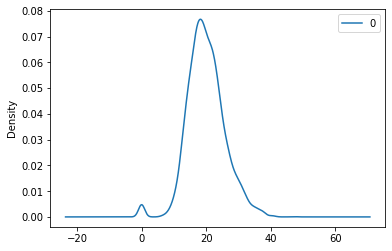

```python
# Run this cell first.  Do NOT edit this cell.
Answer1 = Answer2 = Answer3 = Answer4 = Answer5 = dist = None
import pandas as pd
import numpy as np
import matplotlib
import matplotlib.pyplot as plt
#%matplotlib notebook
#%matplotlib inline
table = pd.read_csv('Survey-3654-Fall2020-clean-HW06.csv') 
table.shape
```


    (87, 22)


Define a distance function, called *dist(i,j)*, that returns the L1 distance  between any two given students in the z-score normalized survey data. For quantitative columns, use z-score normalized data (do not include the Name column in the distance metric). You must write your own code for this metric, you cannot use a library method that computes distances.  Parameters i & j are indices of rows in the original table, and the function returns a float.  For example, the dist between the first two people (Ethan Farmer and Ruimin) is 29.267396.  Return your distance function in Answer1.  If you return the function successfully, the cell should print something like "<function __main__.dist(i, j)>".


```python
# Problem 1
# Compute L1 distance between two points 

# z-score normalize data
quanttable = table.iloc[:,1:]
ztable = (quanttable - quanttable.mean()) / quanttable.std()

# compute L1 distance function -- return float
def dist(i,j): # i & j are indices of rows in original table
    return (ztable.loc[i] - ztable.loc[j]).abs().sum()
    
Answer1 = dist
Answer1
```


    <function __main__.dist(i, j)>


Compute the n x n distance matrix over all pairs of people in the survey, using your distance function from Problem 1. The matrix should be in the same row order as the data file. Represent the distance matrix as a pandas.DataFrame(dtype=float,...). You may need to consider the efficiency of your dist() solution and your matrix computation, but don't worry if it takes ~10 seconds or so to run.  Return the matrix as Answer2.


```python
len(ztable.columns)
```


    21


```python
# Problem 2
# n x n distance matrix over all pairs of people in survey

#pairs = ztable.apply(lambda row: (ztable-row).abs().sum(axis=1), axis=1)
pairs = ztable.apply(lambda i: dist(i,(i[0],i[1],i[2],i[3],i[4],i[5],i[6],
                                       i[7],i[8],i[9],i[10],i[11],i[12],i[13],
                                       i[14],i[15],i[16],i[17],i[18],i[19],i[20])))

# represent distance matrix as pandas dataframe
Answer2 = pairs

pairs.head()
```


    ---------------------------------------------------------------------------

    KeyError                                  Traceback (most recent call last)

    <ipython-input-256-89e49b7b9bb3> in <module>
          3 
          4 #pairs = ztable.apply(lambda row: (ztable-row).abs().sum(axis=1), axis=1)
    ----> 5 pairs = ztable.apply(lambda i: dist(i,(i[0],i[1],i[2],i[3],i[4],i[5],i[6],
          6                                        i[7],i[8],i[9],i[10],i[11],i[12],i[13],
          7                                        i[14],i[15],i[16],i[17],i[18],i[19],i[20])))
    

    ~\Anaconda3\lib\site-packages\pandas\core\frame.py in apply(self, func, axis, broadcast, raw, reduce, result_type, args, **kwds)
       6485                          args=args,
       6486                          kwds=kwds)
    -> 6487         return op.get_result()
       6488 
       6489     def applymap(self, func):
    

    ~\Anaconda3\lib\site-packages\pandas\core\apply.py in get_result(self)
        149             return self.apply_raw()
        150 
    --> 151         return self.apply_standard()
        152 
        153     def apply_empty_result(self):
    

    ~\Anaconda3\lib\site-packages\pandas\core\apply.py in apply_standard(self)
        255 
        256         # compute the result using the series generator
    --> 257         self.apply_series_generator()
        258 
        259         # wrap results
    

    ~\Anaconda3\lib\site-packages\pandas\core\apply.py in apply_series_generator(self)
        284             try:
        285                 for i, v in enumerate(series_gen):
    --> 286                     results[i] = self.f(v)
        287                     keys.append(v.name)
        288             except Exception as e:
    

    <ipython-input-256-89e49b7b9bb3> in <lambda>(i)
          5 pairs = ztable.apply(lambda i: dist(i,(i[0],i[1],i[2],i[3],i[4],i[5],i[6],
          6                                        i[7],i[8],i[9],i[10],i[11],i[12],i[13],
    ----> 7                                        i[14],i[15],i[16],i[17],i[18],i[19],i[20])))
          8 
          9 # represent distance matrix as pandas dataframe
    

    <ipython-input-252-89296a13b5b8> in dist(i, j)
          8 # compute L1 distance function -- return float
          9 def dist(i,j): # i & j are indices of rows in original table
    ---> 10     return (ztable.loc[i] - ztable.loc[j]).abs().sum()
         11 
         12 Answer1 = dist
    

    ~\Anaconda3\lib\site-packages\pandas\core\indexing.py in __getitem__(self, key)
       1498 
       1499             maybe_callable = com.apply_if_callable(key, self.obj)
    -> 1500             return self._getitem_axis(maybe_callable, axis=axis)
       1501 
       1502     def _is_scalar_access(self, key):
    

    ~\Anaconda3\lib\site-packages\pandas\core\indexing.py in _getitem_axis(self, key, axis)
       1900                     raise ValueError('Cannot index with multidimensional key')
       1901 
    -> 1902                 return self._getitem_iterable(key, axis=axis)
       1903 
       1904             # nested tuple slicing
    

    ~\Anaconda3\lib\site-packages\pandas\core\indexing.py in _getitem_iterable(self, key, axis)
       1203             # A collection of keys
       1204             keyarr, indexer = self._get_listlike_indexer(key, axis,
    -> 1205                                                          raise_missing=False)
       1206             return self.obj._reindex_with_indexers({axis: [keyarr, indexer]},
       1207                                                    copy=True, allow_dups=True)
    

    ~\Anaconda3\lib\site-packages\pandas\core\indexing.py in _get_listlike_indexer(self, key, axis, raise_missing)
       1159         self._validate_read_indexer(keyarr, indexer,
       1160                                     o._get_axis_number(axis),
    -> 1161                                     raise_missing=raise_missing)
       1162         return keyarr, indexer
       1163 
    

    ~\Anaconda3\lib\site-packages\pandas\core\indexing.py in _validate_read_indexer(self, key, indexer, axis, raise_missing)
       1244                 raise KeyError(
       1245                     u"None of [{key}] are in the [{axis}]".format(
    -> 1246                         key=key, axis=self.obj._get_axis_name(axis)))
       1247 
       1248             # We (temporarily) allow for some missing keys with .loc, except in
    

    KeyError: ("None of [Float64Index([ -0.600270996753044, -0.1539156401930883, -0.1539156401930883,\n              -0.1539156401930883,  -0.600270996753044,  -0.600270996753044,\n               0.2924397163668674, -0.1539156401930883,  -0.600270996753044,\n              -0.1539156401930883,  -0.600270996753044, -0.1539156401930883,\n              -0.1539156401930883, -1.0466263533129996,  -0.600270996753044,\n               -0.600270996753044, -0.1539156401930883, -0.1539156401930883,\n              -0.1539156401930883,  0.7387950729268231, -0.1539156401930883,\n               -0.600270996753044, -0.1539156401930883,  -0.600270996753044,\n               1.6315057860467346,    2.07786114260669,  -0.600270996753044,\n               -0.600270996753044, -1.0466263533129996,  0.2924397163668674,\n              -0.1539156401930883,  -0.600270996753044,  -0.600270996753044,\n              -0.1539156401930883,   2.524216499166646,  0.7387950729268231,\n              -0.1539156401930883,  0.2924397163668674, -0.1539156401930883,\n               -0.600270996753044,  0.2924397163668674,  0.2924397163668674,\n              -0.1539156401930883,  0.2924397163668674,  -0.600270996753044,\n               0.2924397163668674,  -0.600270996753044, -0.1539156401930883,\n               -0.600270996753044,  -0.600270996753044,  -0.600270996753044,\n              -0.1539156401930883,  0.2924397163668674,  -0.600270996753044,\n               -0.600270996753044,  0.2924397163668674,  -0.600270996753044,\n               -0.600270996753044,  -0.600270996753044,  -0.600270996753044,\n              -0.1539156401930883,  -0.600270996753044,  -0.600270996753044,\n               -0.600270996753044,  -0.600270996753044, -0.1539156401930883,\n               -0.600270996753044,  -0.600270996753044,  0.2924397163668674,\n               1.6315057860467346,  0.2924397163668674,  -0.600270996753044,\n              -0.1539156401930883, -0.1539156401930883, -0.1539156401930883,\n              -0.1539156401930883, -1.0466263533129996,  -0.600270996753044,\n              -0.1539156401930883,   4.755993281966425,  1.1851504294867787,\n               0.2924397163668674,  0.2924397163668674,  1.6315057860467346,\n              -0.1539156401930883,  1.6315057860467346,   4.755993281966425],\n             dtype='float64')] are in the [index]", 'occurred at index Age')


Who are the closest and farthest pairs of people?  Hints: use NaN on the matrix diagonal to eliminate the 0 self distances from consideration; note the distinction between the min() and idxmin() functions. 

In Answer3, return the result in the following tuple of tuples form:

`((name1, name2, distance12),   # closest pair, name1 < name2
 (name3, name4, distance34))   # farthest pair, name3 < name4`

*Think & Try: Who is most like you?*


```python
# Problem 3
# Closest and farthest pairs

# use NaN on matrix diagonal to eliminate 0s
#np.fill_diagonal(pairs.values, np.NaN)
pairs = pairs.replace(0, np.NaN)

# closest pair
min1_idx = pairs.min(axis=0).idxmin() # get indices
min2_idx = pairs[min1_idx].idxmin()

distance12 = np.nanmin(pairs) # calculate minimum distance
name1 = table.Name[min1_idx] # get name using index
name2 = table.Name[min2_idx]

# farthest pair 
max1_idx = pairs.max(axis=0).idxmax()
max2_idx = pairs[max1_idx].idxmax()

distance34 = np.nanmax(pairs)
name3 = table.Name[max1_idx]
name4 = table.Name[max2_idx]

# return in tuples form
Answer3 = ((name1, name2, distance12),   # closest pair, name1 < name2
           (name3, name4, distance34))   # farthest pair, name3 < name4
Answer3
```


    (('Brandon', 'Mystery76891', 6.267393719566903),
     ('Isabelle', 'John', 47.110021037597875))


Who is most/least like everyone else, based on the mean of each person's distances to all others? Do not include the 0 self distances in the mean computations. (Hint: Series.argsort() might be useful.)  In Answer4, return a list of Names, sorted in order of nearness to everyone else, from nearest to farthest.


```python
# Problem 4
# Sorted list of names ordered by mean distance from a person to everyone except themselves
distances = Answer2

# sort by mean distance
idx = distances.mean().argsort(axis=-1) # outputs sorted array indices
likeness = list(table.iloc[idx,0]) # [each row specified by idx, name column]

# return list of Names, sorted in order of nearness, nearest to farthest
Answer4 = likeness
```

Visualize the distribution of all n^2 distances, including the 0 self distances, as an appropriately labeled KDE plot (kernel density estimation plot https://en.wikipedia.org/wiki/Kernel_density_estimation). Hint: flatten() might be useful. Where is the peak of the most dense portion of the distribtion? Hint: find the plot's curve data in Axes.lines\[0\].get_xydata( ) or similar.  Show the plot here, and return a tuple in Answer5 containing: (plot Axes, distance value corresponding to the KDE peak)


```python
# Problem 5
# KDE Plot

# flatten n^2 distances matrix into 2d
distances = Answer2.values.flatten()

# turn into pandas DataFrame to use .kde() function
distances = pd.DataFrame(distances)
axes = distances.plot.kde()

curve_data = axes.lines[0].get_xydata()
curve_data = pd.DataFrame(curve_data)
curve_data = curve_data.sort_values(1, ascending=False) # by columns, descending

# peak = largest value, since sorted descending, is first element
peak = curve_data.iloc[0,0]

# return a tuple containing (plot Axes, distance value corresponding to the KDE peak)
Answer5 = (axes, peak)
peak

```


<div>
<style scoped>
    .dataframe tbody tr th:only-of-type {
        vertical-align: middle;
    }

    .dataframe tbody tr th {
        vertical-align: top;
    }

    .dataframe thead th {
        text-align: right;
    }
</style>
<table border="1" class="dataframe">
  <thead>
    <tr style="text-align: right;">
      <th></th>
      <th>0</th>
      <th>1</th>
    </tr>
  </thead>
  <tbody>
    <tr>
      <th>443</th>
      <td>18.226249</td>
      <td>7.674210e-02</td>
    </tr>
    <tr>
      <th>442</th>
      <td>18.131935</td>
      <td>7.673284e-02</td>
    </tr>
    <tr>
      <th>444</th>
      <td>18.320564</td>
      <td>7.671159e-02</td>
    </tr>
    <tr>
      <th>441</th>
      <td>18.037621</td>
      <td>7.668263e-02</td>
    </tr>
    <tr>
      <th>445</th>
      <td>18.414878</td>
      <td>7.664258e-02</td>
    </tr>
    <tr>
      <th>440</th>
      <td>17.943306</td>
      <td>7.659033e-02</td>
    </tr>
    <tr>
      <th>446</th>
      <td>18.509192</td>
      <td>7.653642e-02</td>
    </tr>
    <tr>
      <th>439</th>
      <td>17.848992</td>
      <td>7.645483e-02</td>
    </tr>
    <tr>
      <th>447</th>
      <td>18.603507</td>
      <td>7.639462e-02</td>
    </tr>
    <tr>
      <th>438</th>
      <td>17.754678</td>
      <td>7.627503e-02</td>
    </tr>
    <tr>
      <th>448</th>
      <td>18.697821</td>
      <td>7.621882e-02</td>
    </tr>
    <tr>
      <th>437</th>
      <td>17.660363</td>
      <td>7.604991e-02</td>
    </tr>
    <tr>
      <th>449</th>
      <td>18.792136</td>
      <td>7.601089e-02</td>
    </tr>
    <tr>
      <th>436</th>
      <td>17.566049</td>
      <td>7.577849e-02</td>
    </tr>
    <tr>
      <th>450</th>
      <td>18.886450</td>
      <td>7.577286e-02</td>
    </tr>
    <tr>
      <th>451</th>
      <td>18.980764</td>
      <td>7.550700e-02</td>
    </tr>
    <tr>
      <th>435</th>
      <td>17.471735</td>
      <td>7.545992e-02</td>
    </tr>
    <tr>
      <th>452</th>
      <td>19.075079</td>
      <td>7.521577e-02</td>
    </tr>
    <tr>
      <th>434</th>
      <td>17.377420</td>
      <td>7.509355e-02</td>
    </tr>
    <tr>
      <th>453</th>
      <td>19.169393</td>
      <td>7.490183e-02</td>
    </tr>
    <tr>
      <th>433</th>
      <td>17.283106</td>
      <td>7.467902e-02</td>
    </tr>
    <tr>
      <th>454</th>
      <td>19.263707</td>
      <td>7.456801e-02</td>
    </tr>
    <tr>
      <th>455</th>
      <td>19.358022</td>
      <td>7.421729e-02</td>
    </tr>
    <tr>
      <th>432</th>
      <td>17.188791</td>
      <td>7.421633e-02</td>
    </tr>
    <tr>
      <th>456</th>
      <td>19.452336</td>
      <td>7.385277e-02</td>
    </tr>
    <tr>
      <th>431</th>
      <td>17.094477</td>
      <td>7.370592e-02</td>
    </tr>
    <tr>
      <th>457</th>
      <td>19.546650</td>
      <td>7.347761e-02</td>
    </tr>
    <tr>
      <th>430</th>
      <td>17.000163</td>
      <td>7.314878e-02</td>
    </tr>
    <tr>
      <th>458</th>
      <td>19.640965</td>
      <td>7.309498e-02</td>
    </tr>
    <tr>
      <th>459</th>
      <td>19.735279</td>
      <td>7.270803e-02</td>
    </tr>
    <tr>
      <th>...</th>
      <td>...</td>
      <td>...</td>
    </tr>
    <tr>
      <th>984</th>
      <td>69.250316</td>
      <td>3.905623e-119</td>
    </tr>
    <tr>
      <th>13</th>
      <td>-22.328924</td>
      <td>1.869668e-119</td>
    </tr>
    <tr>
      <th>985</th>
      <td>69.344631</td>
      <td>4.116798e-120</td>
    </tr>
    <tr>
      <th>12</th>
      <td>-22.423238</td>
      <td>1.933422e-120</td>
    </tr>
    <tr>
      <th>986</th>
      <td>69.438945</td>
      <td>4.298088e-121</td>
    </tr>
    <tr>
      <th>11</th>
      <td>-22.517553</td>
      <td>1.980319e-121</td>
    </tr>
    <tr>
      <th>987</th>
      <td>69.533259</td>
      <td>4.444648e-122</td>
    </tr>
    <tr>
      <th>10</th>
      <td>-22.611867</td>
      <td>2.009047e-122</td>
    </tr>
    <tr>
      <th>988</th>
      <td>69.627574</td>
      <td>4.552458e-123</td>
    </tr>
    <tr>
      <th>9</th>
      <td>-22.706181</td>
      <td>2.018792e-123</td>
    </tr>
    <tr>
      <th>989</th>
      <td>69.721888</td>
      <td>4.618500e-124</td>
    </tr>
    <tr>
      <th>8</th>
      <td>-22.800496</td>
      <td>2.009275e-124</td>
    </tr>
    <tr>
      <th>990</th>
      <td>69.816202</td>
      <td>4.640901e-125</td>
    </tr>
    <tr>
      <th>7</th>
      <td>-22.894810</td>
      <td>1.980768e-125</td>
    </tr>
    <tr>
      <th>991</th>
      <td>69.910517</td>
      <td>4.619023e-126</td>
    </tr>
    <tr>
      <th>6</th>
      <td>-22.989124</td>
      <td>1.934079e-126</td>
    </tr>
    <tr>
      <th>992</th>
      <td>70.004831</td>
      <td>4.553489e-127</td>
    </tr>
    <tr>
      <th>5</th>
      <td>-23.083439</td>
      <td>1.870515e-127</td>
    </tr>
    <tr>
      <th>993</th>
      <td>70.099145</td>
      <td>4.446158e-128</td>
    </tr>
    <tr>
      <th>4</th>
      <td>-23.177753</td>
      <td>1.791821e-128</td>
    </tr>
    <tr>
      <th>994</th>
      <td>70.193460</td>
      <td>4.300035e-129</td>
    </tr>
    <tr>
      <th>3</th>
      <td>-23.272067</td>
      <td>1.700100e-129</td>
    </tr>
    <tr>
      <th>995</th>
      <td>70.287774</td>
      <td>4.119129e-130</td>
    </tr>
    <tr>
      <th>2</th>
      <td>-23.366382</td>
      <td>1.597721e-130</td>
    </tr>
    <tr>
      <th>996</th>
      <td>70.382088</td>
      <td>3.908276e-131</td>
    </tr>
    <tr>
      <th>1</th>
      <td>-23.460696</td>
      <td>1.487214e-131</td>
    </tr>
    <tr>
      <th>997</th>
      <td>70.476403</td>
      <td>3.672921e-132</td>
    </tr>
    <tr>
      <th>0</th>
      <td>-23.555011</td>
      <td>1.371174e-132</td>
    </tr>
    <tr>
      <th>998</th>
      <td>70.570717</td>
      <td>3.418883e-133</td>
    </tr>
    <tr>
      <th>999</th>
      <td>70.665032</td>
      <td>3.152125e-134</td>
    </tr>
  </tbody>
</table>
<p>1000 rows × 2 columns</p>
</div>





```python
# scratch space

```
