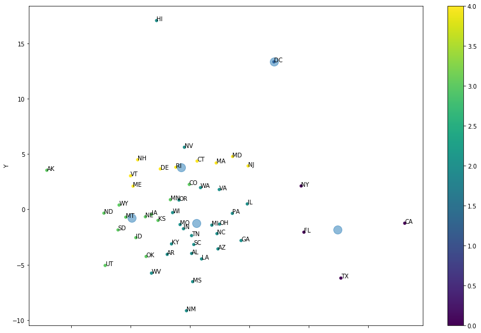
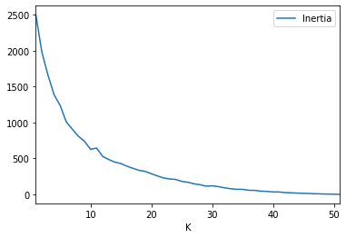
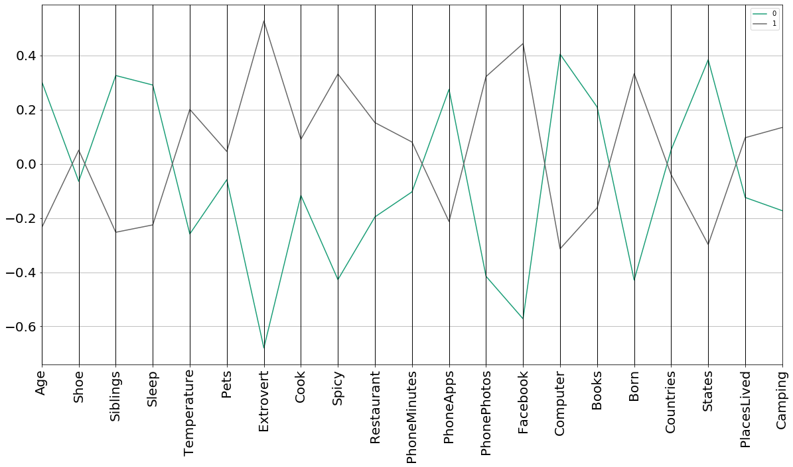

```python
# Run this cell first.  Do NOT edit this cell.
Answer1 = Answer2 = Answer3 = Answer4 = Answer5 = None
import pandas as pd
import numpy as np
import matplotlib
import matplotlib.pyplot as plt
import sklearn.cluster
import sklearn.manifold
#%matplotlib inline
states = pd.read_csv('State_demographics.csv') 
survey = pd.read_csv('Survey-3654-Fall2020-clean-HW07.csv')
states.shape, survey.shape
```


    ((51, 52), (87, 22))


What are 5 clusters in the States data?  Extract and z-score normalize the quantitative columns of the State-demographics data.  Then, compute k=5 clusters of states using the k-means algorithm.

For grading purposes, eliminate the randomness of the initial step of k-means by initializing the 5 centroids using these data points in this order: 'CA','DC','LA','MT','NH' (hint: 'init' parameter of KMeans, and n_init=1).  Use the default values for other unspecified parameters.

In Answer1, return a DataFrame containing only 'State' column and 'Cluster' label column, sorted by increasing Cluster label (number).


```python
# Problem 1
import sklearn.cluster as cl

# extract the quantitative columns of State-demographics data
states_quant = states.iloc[:,2:]

# z-score normalize State-demographics data
zstates = (states_quant - states_quant.mean()) / states_quant.std()

# initialize 5 centroids using 'CA','DC','LA','MT','NH'
# add qualitative columns back to normalized data
abbrev = states.iloc[:, 1] # get only abbrev column
zcombined = pd.concat([abbrev, zstates], axis=1)

# extract as a dataframe from normalized data
centroids = zcombined[zcombined.Abbrev.isin(['CA','DC','LA','MT','NH'])]
centroids = centroids.iloc[:,1:]

km = cl.KMeans(n_clusters=5, n_init=1, init=centroids)
labels = km.fit_predict(zstates)
zstates['Cluster'] = labels # CID = Cluster ID

# return DataFrame of 'State' and 'Cluster', sorted by increasing Cluster label

Answer1 = pd.concat([states.State, zstates.Cluster], axis=1)
Answer1 = Answer1.sort_values(by='Cluster', ascending=True)
```

How can the data be reduced to 2 dimensions?  Use MDS with L2 Euclidean distance to reduce the dimensionality of the same z-scored quantitative columns to 2 dimensions (hint: MDS can compute L2 distances for you if you use 'euclidean' dissimilarity instead of 'precomputed').

For grading purposes, eliminate the randomness of the initial step of MDS by initializing the 2 reduced dimensions with the data in columns: 
"Education.Bachelor's Degree or Higher", "Income.Per Capita Income"
(hint: use the 'init' parameter of MDS.fit_transform). Set n_init=1, eps=0 and max_iter=1000. Use the default values for  other unspecified parameters.

In Answer2, return a DataFrame containing the 'State' column and the new 'X' and 'Y' columns, sorted by increasing 'Y'.


```python
# Problem 2
import sklearn.manifold as mani

# calculate z-normalized values
zstates = (states_quant - states_quant.mean()) / states_quant.std()

# reduce z-normalized values to 2D -- use L2 Euclidean distance
mds = mani.MDS(n_init = 1, eps = 0, max_iter = 1000)

# initialize 2 reduced dimensions: "Education.Bachelor's Degree or Higher", "Income.Per Capita Income"
# returns an array
data2D = mds.fit_transform(zstates, init=zstates[["Education.Bachelor's Degree or Higher", "Income.Per Capita Income"]])

# DataFrame containing 'State' column and new 'X' and 'Y'
df2D = pd.DataFrame(states.State)
df2D['X'] = data2D[:,0]
df2D['Y'] = data2D[:,1]

# sort values by increasing 'Y'
Answer2 = df2D.sort_values('Y')

Answer2.head()
```


<div>
<style scoped>
    .dataframe tbody tr th:only-of-type {
        vertical-align: middle;
    }

    .dataframe tbody tr th {
        vertical-align: top;
    }

    .dataframe thead th {
        text-align: right;
    }
</style>
<table border="1" class="dataframe">
  <thead>
    <tr style="text-align: right;">
      <th></th>
      <th>State</th>
      <th>X</th>
      <th>Y</th>
    </tr>
  </thead>
  <tbody>
    <tr>
      <th>31</th>
      <td>New Mexico</td>
      <td>-0.285137</td>
      <td>-9.159046</td>
    </tr>
    <tr>
      <th>24</th>
      <td>Mississippi</td>
      <td>0.236394</td>
      <td>-6.536576</td>
    </tr>
    <tr>
      <th>43</th>
      <td>Texas</td>
      <td>12.722746</td>
      <td>-6.212489</td>
    </tr>
    <tr>
      <th>48</th>
      <td>West Virginia</td>
      <td>-3.232024</td>
      <td>-5.767393</td>
    </tr>
    <tr>
      <th>44</th>
      <td>Utah</td>
      <td>-7.130742</td>
      <td>-5.073875</td>
    </tr>
  </tbody>
</table>
</div>


How would you describe the categorization of the states?   For this question, put the previous two answers together in a visualization.  Draw a scatterplot of the MDS result, and color the dots by their cluster memberships.  Label each dot with its state abbreviation (Hint: axes.text( )).  

Compute the 2D cluster centroids of the 2-dimensional X,Y data from MDS, and plot the centroids in the same plot, using the same color scheme, but make the centroids dots much larger than the state dots and give them transparency (alpha).

Display the plot, but Answer3 only needs to store the 2D centroids as a DataFrame with columns 'X','Y', indexed and sorted by cluster label. 

*Think about:* Do the clusters overlap? Are the points always nearest to their own centroid? Why might the clusters not necessarily look strictly clustered in the MDS plot?  Hint: think high-dimensionally.


```python
# Problem 3

# draw scatterplot of MDS result
# color dots by their cluster memberships
plot = df2D.plot.scatter(x='X', y='Y', c=labels, cmap='viridis', figsize=(15,10))

# label each dot with state abbreviation
for i in range(len(df2D)):
    plot.text(df2D.X[i], df2D.Y[i], states.Abbrev[i]) # text(x=float,y=float,s=str)

# compute 2D cluster centroids of 2D X,Y data from MDS
# centroid is the mean of all points belonging to the cluster
# create data frame
df = pd.DataFrame()
df['X'] = data2D[:,0]
df['Y'] = data2D[:,1]
df['CID'] = labels

# compute centroids (mean) of every cluster
centroids = df.groupby('CID').mean()

# plot centroids in same plot-- make centroid dots larger and give them transparency 
centroids_plot = centroids.plot.scatter(x='X', y='Y', ax=plot, alpha=0.5, s=200, figsize=(15,10))

# Answer3 stores 2D centroids as DataFrame w/ columns 'X', 'Y'
# sorted by cluster label
Answer3 = centroids
```





Is there a natural number of clusters for the States data?  Conduct an "elbow" analysis by re-running k-means with all possible values of k. Display a line plot, with circle markers, of 'total within-cluster variance' (kmeans.inertia_) as a function of k.  To get good results, you will want to use the default init='k-means++' parameter. For reasonable running times, use n_init=3 and max_iter=20.

Display the plot, but Answer4 only needs to store the results as a DataFrame with columns 'K' and 'Inertia', sorted by increasing K. 


```python
# Problem 4
# Elbow Analysis

# inertia_ : sum of squared distances of samples to their closest centroid

# re-calculate norm
norm = (states_quant - states_quant.mean()) / states_quant.std()


# re-running k-meanswith all possible values of k
data = []
for i in range(1,len(norm)+1): # min clusters:1, max clusters: 51
    km = cl.KMeans(n_clusters=i, init='k-means++', n_init=3, max_iter=20)
    labels = km.fit_predict(norm)
    #print(i, km.inertia_)
    data.append((i, km.inertia_)) # append a tuple     

# display a line plot w/ circle markers of 'total within-cluster variance' as a function of k
df = pd.DataFrame(data, columns=['K','Inertia'])
df.plot.line(x='K', y='Inertia')


# Answer4 store results as a DataFrame with columns 'K' and 'Inertia'
# sorted by increasing K
Answer4 = df.sort_values('K')
Answer4.head()
```


<div>
<style scoped>
    .dataframe tbody tr th:only-of-type {
        vertical-align: middle;
    }

    .dataframe tbody tr th {
        vertical-align: top;
    }

    .dataframe thead th {
        text-align: right;
    }
</style>
<table border="1" class="dataframe">
  <thead>
    <tr style="text-align: right;">
      <th></th>
      <th>K</th>
      <th>Inertia</th>
    </tr>
  </thead>
  <tbody>
    <tr>
      <th>0</th>
      <td>1</td>
      <td>2500.000000</td>
    </tr>
    <tr>
      <th>1</th>
      <td>2</td>
      <td>1975.818084</td>
    </tr>
    <tr>
      <th>2</th>
      <td>3</td>
      <td>1659.492959</td>
    </tr>
    <tr>
      <th>3</th>
      <td>4</td>
      <td>1386.424922</td>
    </tr>
    <tr>
      <th>4</th>
      <td>5</td>
      <td>1238.084631</td>
    </tr>
  </tbody>
</table>
</div>





Complete the following sentence: "There are two kinds of people in the world (well, in our class anyway), ..."  How would you describe those two kinds of people?

Using the Survey data, z-score normalize the quantitative dimensions, use k-means to find 2 clusters, and then visualize the centroids using Parallel Coordinates to find the answer.  

Hint:  Use clustering, and find out what is most different about their centroids.  Rerun your analysis several times to see what columns are most consistently most different.  Since this data is more complex, use n_init=100, max_iter=100.  Visually justify your claim by displaying a Parallel Coordinates plot of the z-score centroids.

In Answer5, return a Series, indexed by the quantitative column names, containing the absolute-value difference between the z-score centroids, sorted in decreasing magnitude.


```python
# Problem 5
# z-score normalize quant columns of survey data
quant = survey.iloc[:,1:]
norm = (quant - quant.mean()) / quant.std()

# use k-means to find 2 clusters
km = cl.KMeans(n_clusters=2, n_init=100, max_iter=100)
labels = km.fit_predict(norm)
norm['CID'] = labels

# visualize centroids using Parallel Coordinates
centroids = norm.groupby('CID').mean()
centroids['CID'] = centroids.index

# customize plot as desired
pllplot = pd.plotting.parallel_coordinates(centroids, 'CID', colormap='Dark2')
pllplot.set_xticklabels(centroids.columns, rotation=90)
pllplot.figure.set_size_inches(20, 10)
pllplot.tick_params(labelsize=20)

# return a Series, indexed by the quantitative column names, 
#containing the absolute-value difference between the z-score centroids, 
#sorted in decreasing magnitude.
centroids = centroids.iloc[:, :-1] # drop the last column, 'CID'
diff = (centroids.loc[0] - centroids.loc[1]).abs()
Answer5 = diff.sort_values(ascending=False)
```




