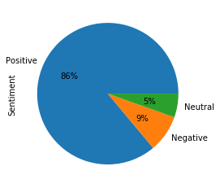
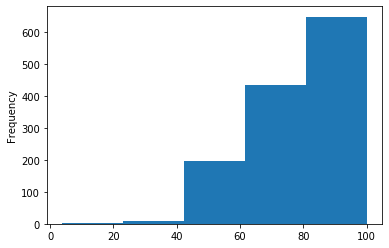
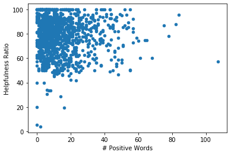
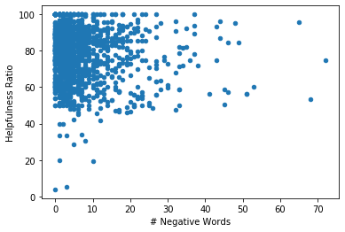

## Question
Is review 'helpfulness' ratio a good indicator for review sentiment?

## Rationale
With a countless number of movies and TV shows to choose from, people often use online reviews to narrow down which ones they should watch. As it turns out, there are also countless numbers of reviews to sift through for almost every media, especially the popular ones. 'Helpful' ratings allow users to anonymously vote on whether or not a particular review is helpful, and signaling if it is worth reading to others. Something that I'm curious about is the basis upon which people cast this vote, and whether it is influenced by the review content's sentiment, (i.e. positive or negative word-choice). Perhaps this analysis can uncover a pattern that leads users to vote a certain way for the reviews they read, and help inform myself on how to write more effective reviews that others find helpful.

# Step 1:
### Data
The data source is 'https://www.imdb.com/search/keyword/?keywords=anime', which is up to date as of November 1, 2020. It contains the most popular most popular Anime movies and TV shows from IMDb, a popular rating/review site. In Homework 8 I scraped the data for the top 50 most popular entries with requests and parsed with BeautifulSoup. I have loaded the data as a pandas DataFrame below.


```python
import pandas as pd

data = pd.read_csv('Homework08.csv')
data.head()
```


<div>
<style scoped>
    .dataframe tbody tr th:only-of-type {
        vertical-align: middle;
    }

    .dataframe tbody tr th {
        vertical-align: top;
    }

    .dataframe thead th {
        text-align: right;
    }
</style>
<table border="1" class="dataframe">
  <thead>
    <tr style="text-align: right;">
      <th></th>
      <th>Unnamed: 0</th>
      <th>Title</th>
      <th>Rating</th>
      <th>Date</th>
      <th>Author</th>
      <th>Review Text</th>
      <th>Helpfulness</th>
      <th>URL</th>
    </tr>
  </thead>
  <tbody>
    <tr>
      <th>0</th>
      <td>0</td>
      <td>Attack on Titan</td>
      <td>10.0</td>
      <td>17 December 2019</td>
      <td>henchey</td>
      <td>Before I started watching this show, I couldn'...</td>
      <td>99 out of 100 found this helpful.</td>
      <td>https://www.imdb.com//title/tt2560140/reviews</td>
    </tr>
    <tr>
      <th>1</th>
      <td>1</td>
      <td>Attack on Titan</td>
      <td>10.0</td>
      <td>19 June 2019</td>
      <td>infectedkarma</td>
      <td>The moment you watch this audiovisual masterpi...</td>
      <td>340 out of 353 found this helpful.</td>
      <td>https://www.imdb.com//title/tt2560140/reviews</td>
    </tr>
    <tr>
      <th>2</th>
      <td>2</td>
      <td>Attack on Titan</td>
      <td>10.0</td>
      <td>8 June 2019</td>
      <td>chiarasalvarani</td>
      <td>I'm not an expert of anime. I haven't even rea...</td>
      <td>73 out of 74 found this helpful.</td>
      <td>https://www.imdb.com//title/tt2560140/reviews</td>
    </tr>
    <tr>
      <th>3</th>
      <td>3</td>
      <td>Attack on Titan</td>
      <td>10.0</td>
      <td>4 January 2020</td>
      <td>WarFirel</td>
      <td>A lot of people have this question, can season...</td>
      <td>42 out of 42 found this helpful.</td>
      <td>https://www.imdb.com//title/tt2560140/reviews</td>
    </tr>
    <tr>
      <th>4</th>
      <td>4</td>
      <td>Attack on Titan</td>
      <td>10.0</td>
      <td>17 October 2018</td>
      <td>WarFirel</td>
      <td>The best part of the series is coming in april...</td>
      <td>371 out of 396 found this helpful.</td>
      <td>https://www.imdb.com//title/tt2560140/reviews</td>
    </tr>
  </tbody>
</table>
</div>


# Step 2:
## Processing
Since we now have our data, the columns we are mainly interested in are the 'Review Text' and 'Helpfulness'. To begin analyzing the text sentiment of these reviews, we create a bag of words from every one. We clean the review data by removing punctuations and whitespace, and converting everything to lowercase.


```python
text = data['Review Text']
text = text.str.lower() # convert to lowercase
# replace punctuation with white space
text = text.str.replace(',',' ').str.replace('.',' ').str.replace('!', ' ')
text = text.str.replace('?', ' ').str.replace(':', ' ').str.replace(';', ' ') 

bag = [t.split() for t in text] # create bag of words for each review 
```

Then, we load in the lists of positive and negative words to compare to our bags of words for every review. We see that in the list, there are more negative than positive words.


```python
# load in positive and negative bags of words
positives = set(open('positive.txt').read().split())
positives
negatives = set(open('negative.txt').read().split())
negatives

len(positives), len(negatives) # more negative words than positive words
```


    (1913, 3351)


We iterate through every sub-list, or bag of words, for each review to compare with the positive and negative word lists. We create a list of the number of positive and negative words found in each review.


```python
# compare with reviews
# iterate through every list in the bag and perform the comparison
p = [] # list of number of positive terms in reviews
n = [] # list of number of negative terms in reviews
total = [] # list of total number of words in review
for i in range(len(bag)):
    p.append(len([w for w in bag[i] if w in positives]))
    n.append(len([w for w in bag[i] if w in negatives]))
    total.append(len(bag[i]))
```

Then, we create a 'Helpfulness Ratio' column in the tab by extracting the two numbers from the 'Helpfulness' column rows, then compute the ratio by dividing them.


```python
help_text = data['Helpfulness']
help_text = help_text.str.replace(' out of ', ' ').str.replace(' found this helpful.', '').str.replace(',', '')
split = [w.split() for w in help_text] # split extracted numbers into list entries

# convert list entries from string to int
help_int = []
for i in split:
    help_int.append(list(map(int, i)))

import numpy as np
    
ratio = []
numerator = [] # helpfulness rating numerator
denominator = [] # helpfullness rating denominator
for i in help_int:
    numerator.append(i[0])
    denominator.append(i[1])
    if i[1] != 0:
        ratio.append(round( ((i[0] / i[1]) * 100),2) )
    else:
        ratio.append(np.NaN)

# clean up to fill blank rows with column mean  
ratio = pd.Series(ratio)
ratio = ratio.fillna(round(ratio.mean(),2))
```

Next, we create a DataFrame containing our new data. There is an addition of a 'Sentiment' column which determines whether a review is positive, negative, or neutral sentiment by comparing the number of positive and negative words found in them. We also included columns of the numbers of positive and negative words, as well as review length.


```python
analysis = pd.DataFrame({
    "Title": data['Title'],
    "Helpfulness Ratio": ratio,
    "Review Text": data['Review Text'],
    "# Positive Words": p,
    "# Negative Words": n,
    "Review Length": total
})

analysis['Sentiment'] = np.where(analysis['# Positive Words'] == analysis['# Negative Words'], 'Neutral', 
                                 np.where(analysis['# Positive Words'] > analysis['# Negative Words'], 'Positive', 'Negative'))
analysis
```


<div>
<style scoped>
    .dataframe tbody tr th:only-of-type {
        vertical-align: middle;
    }

    .dataframe tbody tr th {
        vertical-align: top;
    }

    .dataframe thead th {
        text-align: right;
    }
</style>
<table border="1" class="dataframe">
  <thead>
    <tr style="text-align: right;">
      <th></th>
      <th>Title</th>
      <th>Helpfulness Ratio</th>
      <th>Review Text</th>
      <th># Positive Words</th>
      <th># Negative Words</th>
      <th>Review Length</th>
      <th>Sentiment</th>
    </tr>
  </thead>
  <tbody>
    <tr>
      <th>0</th>
      <td>Attack on Titan</td>
      <td>99.00</td>
      <td>Before I started watching this show, I couldn'...</td>
      <td>19</td>
      <td>8</td>
      <td>182</td>
      <td>Positive</td>
    </tr>
    <tr>
      <th>1</th>
      <td>Attack on Titan</td>
      <td>96.32</td>
      <td>The moment you watch this audiovisual masterpi...</td>
      <td>15</td>
      <td>5</td>
      <td>192</td>
      <td>Positive</td>
    </tr>
    <tr>
      <th>2</th>
      <td>Attack on Titan</td>
      <td>98.65</td>
      <td>I'm not an expert of anime. I haven't even rea...</td>
      <td>10</td>
      <td>4</td>
      <td>85</td>
      <td>Positive</td>
    </tr>
    <tr>
      <th>3</th>
      <td>Attack on Titan</td>
      <td>100.00</td>
      <td>A lot of people have this question, can season...</td>
      <td>3</td>
      <td>2</td>
      <td>58</td>
      <td>Positive</td>
    </tr>
    <tr>
      <th>4</th>
      <td>Attack on Titan</td>
      <td>93.69</td>
      <td>The best part of the series is coming in april...</td>
      <td>1</td>
      <td>0</td>
      <td>29</td>
      <td>Positive</td>
    </tr>
    <tr>
      <th>5</th>
      <td>Attack on Titan</td>
      <td>100.00</td>
      <td>This is the anime ever made because we all kno...</td>
      <td>3</td>
      <td>2</td>
      <td>97</td>
      <td>Positive</td>
    </tr>
    <tr>
      <th>6</th>
      <td>Attack on Titan</td>
      <td>95.24</td>
      <td>Each season gets better and better! S3 P2 is u...</td>
      <td>3</td>
      <td>0</td>
      <td>12</td>
      <td>Positive</td>
    </tr>
    <tr>
      <th>7</th>
      <td>Attack on Titan</td>
      <td>100.00</td>
      <td>Trust me, you'll be having almost panic-attack...</td>
      <td>7</td>
      <td>0</td>
      <td>72</td>
      <td>Positive</td>
    </tr>
    <tr>
      <th>8</th>
      <td>Attack on Titan</td>
      <td>100.00</td>
      <td>Some of the people have rated this show a 1 ou...</td>
      <td>21</td>
      <td>6</td>
      <td>216</td>
      <td>Positive</td>
    </tr>
    <tr>
      <th>9</th>
      <td>Attack on Titan</td>
      <td>97.73</td>
      <td>I am writing this review after watching more t...</td>
      <td>5</td>
      <td>2</td>
      <td>107</td>
      <td>Positive</td>
    </tr>
    <tr>
      <th>10</th>
      <td>Attack on Titan</td>
      <td>97.56</td>
      <td>At the time of this review, there are currentl...</td>
      <td>7</td>
      <td>4</td>
      <td>168</td>
      <td>Positive</td>
    </tr>
    <tr>
      <th>11</th>
      <td>Attack on Titan</td>
      <td>89.83</td>
      <td>This anime is simply amazing! The way it is an...</td>
      <td>9</td>
      <td>1</td>
      <td>141</td>
      <td>Positive</td>
    </tr>
    <tr>
      <th>12</th>
      <td>Attack on Titan</td>
      <td>97.14</td>
      <td>Attack On Titan makes it hard for me to enjoy ...</td>
      <td>0</td>
      <td>2</td>
      <td>13</td>
      <td>Negative</td>
    </tr>
    <tr>
      <th>13</th>
      <td>Attack on Titan</td>
      <td>100.00</td>
      <td>How is this show rated only 8.8 ? this makes n...</td>
      <td>5</td>
      <td>1</td>
      <td>66</td>
      <td>Positive</td>
    </tr>
    <tr>
      <th>14</th>
      <td>Attack on Titan</td>
      <td>89.62</td>
      <td>One of the best anime u must watch before u di...</td>
      <td>0</td>
      <td>0</td>
      <td>18</td>
      <td>Neutral</td>
    </tr>
    <tr>
      <th>15</th>
      <td>Attack on Titan</td>
      <td>92.21</td>
      <td>This anime grabbed me in the first episode and...</td>
      <td>15</td>
      <td>6</td>
      <td>207</td>
      <td>Positive</td>
    </tr>
    <tr>
      <th>16</th>
      <td>Attack on Titan</td>
      <td>100.00</td>
      <td>This anime is just... perfect. The music, the ...</td>
      <td>8</td>
      <td>2</td>
      <td>54</td>
      <td>Positive</td>
    </tr>
    <tr>
      <th>17</th>
      <td>Attack on Titan</td>
      <td>96.67</td>
      <td>Attack On Titan is the best anime, maybe I'll ...</td>
      <td>1</td>
      <td>1</td>
      <td>15</td>
      <td>Neutral</td>
    </tr>
    <tr>
      <th>18</th>
      <td>Attack on Titan</td>
      <td>100.00</td>
      <td>Amazing and good and my language not good\n10\...</td>
      <td>3</td>
      <td>0</td>
      <td>14</td>
      <td>Positive</td>
    </tr>
    <tr>
      <th>19</th>
      <td>Attack on Titan</td>
      <td>88.89</td>
      <td>This show is almost absolute perfection. I was...</td>
      <td>2</td>
      <td>0</td>
      <td>50</td>
      <td>Positive</td>
    </tr>
    <tr>
      <th>20</th>
      <td>Attack on Titan</td>
      <td>90.77</td>
      <td>When you think of anime's. When you think of a...</td>
      <td>15</td>
      <td>7</td>
      <td>179</td>
      <td>Positive</td>
    </tr>
    <tr>
      <th>21</th>
      <td>Attack on Titan</td>
      <td>90.28</td>
      <td>"Attack on Titan" is PHENOMENAL!!! There are M...</td>
      <td>8</td>
      <td>7</td>
      <td>247</td>
      <td>Positive</td>
    </tr>
    <tr>
      <th>22</th>
      <td>Attack on Titan</td>
      <td>85.45</td>
      <td>This anime just keeps me on the edge of my sea...</td>
      <td>7</td>
      <td>1</td>
      <td>125</td>
      <td>Positive</td>
    </tr>
    <tr>
      <th>23</th>
      <td>Attack on Titan</td>
      <td>86.15</td>
      <td>A well made anime. The feel this show gives is...</td>
      <td>18</td>
      <td>3</td>
      <td>136</td>
      <td>Positive</td>
    </tr>
    <tr>
      <th>24</th>
      <td>Attack on Titan</td>
      <td>89.41</td>
      <td>Perfect from every prospective story,music, so...</td>
      <td>3</td>
      <td>0</td>
      <td>20</td>
      <td>Positive</td>
    </tr>
    <tr>
      <th>25</th>
      <td>Avatar: The Last Airbender</td>
      <td>98.97</td>
      <td>I don't know when, but for me, Netflix started...</td>
      <td>11</td>
      <td>2</td>
      <td>122</td>
      <td>Positive</td>
    </tr>
    <tr>
      <th>26</th>
      <td>Avatar: The Last Airbender</td>
      <td>100.00</td>
      <td>This is show is one of the best shows ever cre...</td>
      <td>7</td>
      <td>1</td>
      <td>80</td>
      <td>Positive</td>
    </tr>
    <tr>
      <th>27</th>
      <td>Avatar: The Last Airbender</td>
      <td>98.19</td>
      <td>OK, so I was 12 when this show came out and ne...</td>
      <td>25</td>
      <td>10</td>
      <td>344</td>
      <td>Positive</td>
    </tr>
    <tr>
      <th>28</th>
      <td>Avatar: The Last Airbender</td>
      <td>95.87</td>
      <td>Even though Avatar is of American origin, it h...</td>
      <td>28</td>
      <td>3</td>
      <td>275</td>
      <td>Positive</td>
    </tr>
    <tr>
      <th>29</th>
      <td>Avatar: The Last Airbender</td>
      <td>96.23</td>
      <td>This review will be very long. I adore this sh...</td>
      <td>44</td>
      <td>15</td>
      <td>465</td>
      <td>Positive</td>
    </tr>
    <tr>
      <th>...</th>
      <td>...</td>
      <td>...</td>
      <td>...</td>
      <td>...</td>
      <td>...</td>
      <td>...</td>
      <td>...</td>
    </tr>
    <tr>
      <th>1264</th>
      <td>Parasyte: The Maxim</td>
      <td>100.00</td>
      <td>Started out so bizarre, but I was hooked and b...</td>
      <td>2</td>
      <td>1</td>
      <td>30</td>
      <td>Positive</td>
    </tr>
    <tr>
      <th>1265</th>
      <td>Parasyte: The Maxim</td>
      <td>48.65</td>
      <td>Going into this anime I was expecting somethin...</td>
      <td>25</td>
      <td>26</td>
      <td>509</td>
      <td>Negative</td>
    </tr>
    <tr>
      <th>1266</th>
      <td>Parasyte: The Maxim</td>
      <td>46.51</td>
      <td>I really wanted to like Parasyte. Hell, for th...</td>
      <td>15</td>
      <td>17</td>
      <td>257</td>
      <td>Negative</td>
    </tr>
    <tr>
      <th>1267</th>
      <td>Parasyte: The Maxim</td>
      <td>48.39</td>
      <td>It started out strong and I was obsessed. It's...</td>
      <td>9</td>
      <td>12</td>
      <td>174</td>
      <td>Negative</td>
    </tr>
    <tr>
      <th>1268</th>
      <td>Parasyte: The Maxim</td>
      <td>52.94</td>
      <td>I want to like anime so much but seem to strug...</td>
      <td>18</td>
      <td>15</td>
      <td>314</td>
      <td>Positive</td>
    </tr>
    <tr>
      <th>1269</th>
      <td>Bleach</td>
      <td>88.51</td>
      <td>For anyone who enjoys action anime, this is th...</td>
      <td>9</td>
      <td>11</td>
      <td>178</td>
      <td>Negative</td>
    </tr>
    <tr>
      <th>1270</th>
      <td>Bleach</td>
      <td>89.62</td>
      <td>When I first started watching Bleach it was be...</td>
      <td>6</td>
      <td>6</td>
      <td>162</td>
      <td>Neutral</td>
    </tr>
    <tr>
      <th>1271</th>
      <td>Bleach</td>
      <td>83.12</td>
      <td>Okay let's get the facts straight.I noticed th...</td>
      <td>25</td>
      <td>15</td>
      <td>413</td>
      <td>Positive</td>
    </tr>
    <tr>
      <th>1272</th>
      <td>Bleach</td>
      <td>84.13</td>
      <td>I first saw the Bleach manga, and I was absolu...</td>
      <td>17</td>
      <td>11</td>
      <td>305</td>
      <td>Positive</td>
    </tr>
    <tr>
      <th>1273</th>
      <td>Bleach</td>
      <td>82.19</td>
      <td>Every anime has flaws, but when the flaws over...</td>
      <td>7</td>
      <td>8</td>
      <td>137</td>
      <td>Negative</td>
    </tr>
    <tr>
      <th>1274</th>
      <td>Bleach</td>
      <td>76.47</td>
      <td>I first heard the title "Bleach" in a newspape...</td>
      <td>8</td>
      <td>6</td>
      <td>171</td>
      <td>Positive</td>
    </tr>
    <tr>
      <th>1275</th>
      <td>Bleach</td>
      <td>75.76</td>
      <td>I can't remember when I started watching Bleac...</td>
      <td>3</td>
      <td>3</td>
      <td>122</td>
      <td>Neutral</td>
    </tr>
    <tr>
      <th>1276</th>
      <td>Bleach</td>
      <td>74.24</td>
      <td>So it's finally hit the US shores. Bleach. Wha...</td>
      <td>25</td>
      <td>12</td>
      <td>307</td>
      <td>Positive</td>
    </tr>
    <tr>
      <th>1277</th>
      <td>Bleach</td>
      <td>71.67</td>
      <td>I'm not amused that so many people expect this...</td>
      <td>8</td>
      <td>2</td>
      <td>169</td>
      <td>Positive</td>
    </tr>
    <tr>
      <th>1278</th>
      <td>Bleach</td>
      <td>76.00</td>
      <td>This is an excellent anime by Tite Kubo origin...</td>
      <td>3</td>
      <td>2</td>
      <td>121</td>
      <td>Positive</td>
    </tr>
    <tr>
      <th>1279</th>
      <td>Bleach</td>
      <td>69.81</td>
      <td>Bleach, is maybe one of the most sophisticated...</td>
      <td>10</td>
      <td>6</td>
      <td>173</td>
      <td>Positive</td>
    </tr>
    <tr>
      <th>1280</th>
      <td>Bleach</td>
      <td>68.75</td>
      <td>I will start by admitting that, up until a few...</td>
      <td>16</td>
      <td>8</td>
      <td>273</td>
      <td>Positive</td>
    </tr>
    <tr>
      <th>1281</th>
      <td>Bleach</td>
      <td>66.67</td>
      <td>NOTE: For sake of size, I'm ditching giving st...</td>
      <td>10</td>
      <td>4</td>
      <td>164</td>
      <td>Positive</td>
    </tr>
    <tr>
      <th>1282</th>
      <td>Bleach</td>
      <td>51.35</td>
      <td>Before you guys say that I didn't watch Bleach...</td>
      <td>16</td>
      <td>25</td>
      <td>419</td>
      <td>Negative</td>
    </tr>
    <tr>
      <th>1283</th>
      <td>Bleach</td>
      <td>56.25</td>
      <td>Now, I'll be honest I can acknowledge flaws in...</td>
      <td>12</td>
      <td>6</td>
      <td>177</td>
      <td>Positive</td>
    </tr>
    <tr>
      <th>1284</th>
      <td>Bleach</td>
      <td>52.17</td>
      <td>I liked Bleach at first. The first section whe...</td>
      <td>22</td>
      <td>14</td>
      <td>445</td>
      <td>Positive</td>
    </tr>
    <tr>
      <th>1285</th>
      <td>Bleach</td>
      <td>50.00</td>
      <td>Bleach is by far better than such sword-based ...</td>
      <td>10</td>
      <td>5</td>
      <td>241</td>
      <td>Positive</td>
    </tr>
    <tr>
      <th>1286</th>
      <td>Bleach</td>
      <td>50.00</td>
      <td>You wanna know how much I love this show??? I ...</td>
      <td>12</td>
      <td>1</td>
      <td>144</td>
      <td>Positive</td>
    </tr>
    <tr>
      <th>1287</th>
      <td>Bleach</td>
      <td>41.67</td>
      <td>Before I start out, I want to say that my inte...</td>
      <td>23</td>
      <td>12</td>
      <td>400</td>
      <td>Positive</td>
    </tr>
    <tr>
      <th>1288</th>
      <td>Bleach</td>
      <td>50.00</td>
      <td>I've always loved Japanese Manga Animation "ca...</td>
      <td>18</td>
      <td>7</td>
      <td>201</td>
      <td>Positive</td>
    </tr>
    <tr>
      <th>1289</th>
      <td>Bleach</td>
      <td>55.56</td>
      <td>To be honest, i think bleach is one of the mos...</td>
      <td>16</td>
      <td>11</td>
      <td>212</td>
      <td>Positive</td>
    </tr>
    <tr>
      <th>1290</th>
      <td>Bleach</td>
      <td>57.14</td>
      <td>So I had a nice long review written out... nat...</td>
      <td>6</td>
      <td>4</td>
      <td>140</td>
      <td>Positive</td>
    </tr>
    <tr>
      <th>1291</th>
      <td>Bleach</td>
      <td>57.14</td>
      <td>At first, I watched Bleach on accident. I like...</td>
      <td>10</td>
      <td>6</td>
      <td>134</td>
      <td>Positive</td>
    </tr>
    <tr>
      <th>1292</th>
      <td>Bleach</td>
      <td>50.00</td>
      <td>I started anime with Dragon Ball when i was 5 ...</td>
      <td>1</td>
      <td>1</td>
      <td>90</td>
      <td>Neutral</td>
    </tr>
    <tr>
      <th>1293</th>
      <td>Bleach</td>
      <td>50.00</td>
      <td>WOW!!! To tell you the truth, Bleach is my fir...</td>
      <td>11</td>
      <td>6</td>
      <td>229</td>
      <td>Positive</td>
    </tr>
  </tbody>
</table>
<p>1294 rows × 7 columns</p>
</div>


# Step 3:
## Analysis
Now that we have our data processed and organized, we can begin making visualizations and perform analysis to better understand it. First, we create a pie chart to look at the proportions between positive, negative, and neutral sentiment reviews. There appears to be a large majority of positive-sentiment reviews, despite the initial positive word list containing less words than the negative word list.


```python
analysis.Sentiment.value_counts().plot(kind='pie', autopct='%1.0f%%')
```


    <matplotlib.axes._subplots.AxesSubplot at 0x2a6170ea668>





Next, we can plot the distribution of helpfulness ratios across all of the reviews. We can see that the data is skewed toward higher ratios-- suggesting that users found most reviews helpful.


```python
# plot distribution of helpfulness ratios
import matplotlib.pyplot as plt
%matplotlib inline
analysis['Helpfulness Ratio'].plot.hist(bins=5)
```


    <matplotlib.axes._subplots.AxesSubplot at 0x2a616c85dd8>





Going back to our original question, "Is review 'helpfulness' ratio a good indicator for review sentiment?" We can look at the correlation between the number of positive and negative words in a review with its helpfulness ratio. In this case, scatterplots were used to visualize this relationship and a Pearson correlation coefficient was computed.


```python
p_plot = analysis.plot.scatter(x='# Positive Words', y='Helpfulness Ratio')
```





```python
analysis['# Positive Words'].corr(analysis['Helpfulness Ratio'])
```


    -0.04646573184116434


```python
n_plot = analysis.plot.scatter(x='# Negative Words', y='Helpfulness Ratio')
```





```python
analysis['# Negative Words'].corr(analysis['Helpfulness Ratio'])
```


    -0.12205978769724478


Based off of the scatterplots and the pearson correlation test, there appears a very weak-to-no correlation between positive/negative sentiment and helpfulness ratio of reviews.

## Conclusion

In conclusion, there does not seem to be a definitive correlation between review text sentiment and helpfulness rating. 

A limitation of our approach is that reducing the 'helpfulness' column to a percentage neglects the total number of votes a review received. Some had 353 and others had only 3. This leads to potentially skewed data because of different sample sizes. The data collection also provided disproportionate amounts of positive, negative, and neutral reviews, with a heavy majority of positive reviews. This approach only looks at the sentiment-heavy words to try to determine what makes others find a review helpful. It would be interesting to look at the other words, such as stop-words, since these positive and negative-labeled words only comprise a fraction of the entire review.  Perhaps the determiner for helpfulness lies more in the actual content and readibility of the review, which requires more complex analysis.
