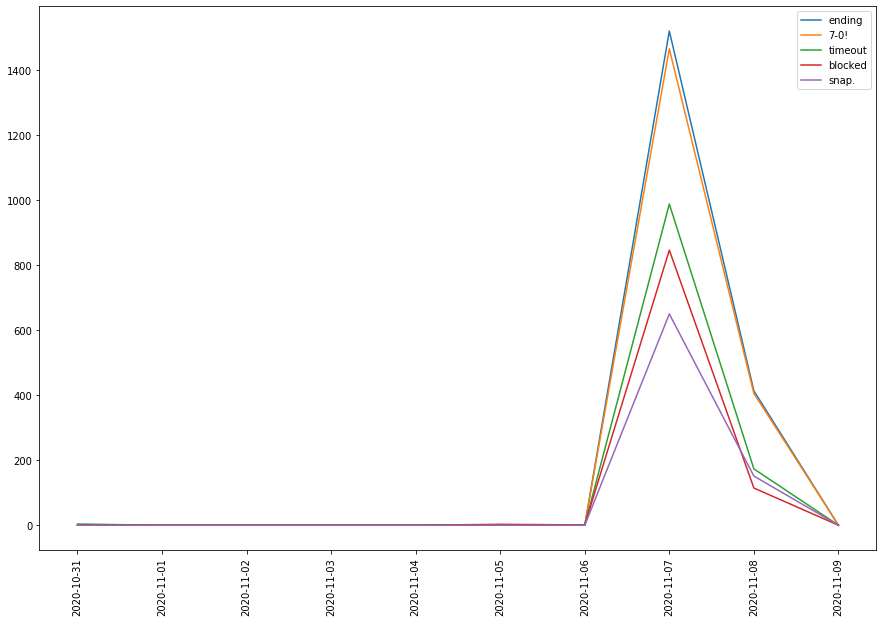
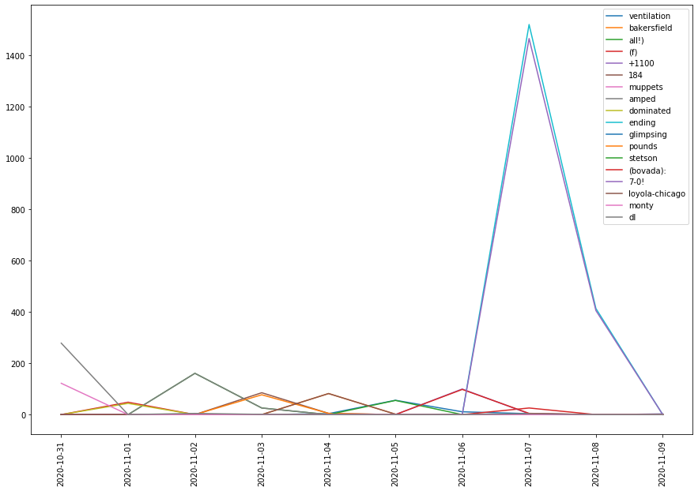

## Question
What distinct events or trending topics occurred between October 31, 2020 and November 8, 2020 related to Virginia Tech?

## Rationale
As a student and/or member of the Virginia Tech community it is important to be informed about the events that occur arpimd us. It is not a very productive use of time to manually scroll through 19167 tweets, so narrowing them down and summarizing them with temporal text analytics is an efficient way to stay informed.

# Step 1:
### Data

Our data source is "VT_tweets_2020Nov.json". This dataset contains 19,167 tweets acquired between October 31 and November 8 that includes the string "Virginia Tech" and/or the hashtag "Hokies". Below we load in the data from the JSON file.


```python
import pandas as pd
import matplotlib
import matplotlib.pyplot as plt
tweets = pd.read_json('VT_tweets_2020Nov.json')
tweets.head()
```


<div>
<style scoped>
    .dataframe tbody tr th:only-of-type {
        vertical-align: middle;
    }

    .dataframe tbody tr th {
        vertical-align: top;
    }

    .dataframe thead th {
        text-align: right;
    }
</style>
<table border="1" class="dataframe">
  <thead>
    <tr style="text-align: right;">
      <th></th>
      <th>favorite_count</th>
      <th>retweet_count</th>
      <th>text</th>
      <th>timestamp</th>
    </tr>
  </thead>
  <tbody>
    <tr>
      <th>0</th>
      <td>0</td>
      <td>356</td>
      <td>ODU loss\nDuke pasting\nLiberty loss\nRecruiti...</td>
      <td>2020-11-09 00:12:37</td>
    </tr>
    <tr>
      <th>1</th>
      <td>0</td>
      <td>0</td>
      <td>I just emailed this petition to my advisor so ...</td>
      <td>2020-11-09 00:12:37</td>
    </tr>
    <tr>
      <th>2</th>
      <td>0</td>
      <td>5</td>
      <td>https://t.co/XTORwScMYJ\n\nRecirculating this ...</td>
      <td>2020-11-09 00:10:29</td>
    </tr>
    <tr>
      <th>3</th>
      <td>1</td>
      <td>0</td>
      <td>Every creepy pasta starts with an episode of T...</td>
      <td>2020-11-09 00:06:00</td>
    </tr>
    <tr>
      <th>4</th>
      <td>1</td>
      <td>0</td>
      <td>This is ridiculous @virginia_tech https://t.co...</td>
      <td>2020-11-09 00:03:55</td>
    </tr>
  </tbody>
</table>
</div>


# Step 2:
Now that we have a DataFrame that contains the tweet data, we can group the tweets by date. 

### Process:
We create a groupby object that condenses the larger DataFrame into individual records aggregated by date. Then create a bag of words for each tweet.


```python
tweets['timestamp'] = tweets['timestamp'].astype(str) # cast timestamps to string
tweets['timestamp'] = tweets['timestamp'].str.slice(start=0, stop=10) # keep only dates; cut off time

# create bag of words for every tweet
tweets['bag'] = tweets.text.map(lambda t: t.replace(',',' ').lower().split())
tweets
```


<div>
<style scoped>
    .dataframe tbody tr th:only-of-type {
        vertical-align: middle;
    }

    .dataframe tbody tr th {
        vertical-align: top;
    }

    .dataframe thead th {
        text-align: right;
    }
</style>
<table border="1" class="dataframe">
  <thead>
    <tr style="text-align: right;">
      <th></th>
      <th>favorite_count</th>
      <th>retweet_count</th>
      <th>text</th>
      <th>timestamp</th>
      <th>bag</th>
    </tr>
  </thead>
  <tbody>
    <tr>
      <th>0</th>
      <td>0</td>
      <td>356</td>
      <td>ODU loss\nDuke pasting\nLiberty loss\nRecruiti...</td>
      <td>2020-11-09</td>
      <td>[odu, loss, duke, pasting, liberty, loss, recr...</td>
    </tr>
    <tr>
      <th>1</th>
      <td>0</td>
      <td>0</td>
      <td>I just emailed this petition to my advisor so ...</td>
      <td>2020-11-09</td>
      <td>[i, just, emailed, this, petition, to, my, adv...</td>
    </tr>
    <tr>
      <th>2</th>
      <td>0</td>
      <td>5</td>
      <td>https://t.co/XTORwScMYJ\n\nRecirculating this ...</td>
      <td>2020-11-09</td>
      <td>[https://t.co/xtorwscmyj, recirculating, this,...</td>
    </tr>
    <tr>
      <th>3</th>
      <td>1</td>
      <td>0</td>
      <td>Every creepy pasta starts with an episode of T...</td>
      <td>2020-11-09</td>
      <td>[every, creepy, pasta, starts, with, an, episo...</td>
    </tr>
    <tr>
      <th>4</th>
      <td>1</td>
      <td>0</td>
      <td>This is ridiculous @virginia_tech https://t.co...</td>
      <td>2020-11-09</td>
      <td>[this, is, ridiculous, @virginia_tech, https:/...</td>
    </tr>
    <tr>
      <th>5</th>
      <td>0</td>
      <td>0</td>
      <td>@virginia_tech what’s up? https://t.co/n8DHIfHMbE</td>
      <td>2020-11-09</td>
      <td>[@virginia_tech, what’s, up?, https://t.co/n8d...</td>
    </tr>
    <tr>
      <th>6</th>
      <td>0</td>
      <td>8</td>
      <td>The billboard for Virginia Tech students Heidi...</td>
      <td>2020-11-09</td>
      <td>[the, billboard, for, virginia, tech, students...</td>
    </tr>
    <tr>
      <th>7</th>
      <td>0</td>
      <td>8</td>
      <td>The billboard for Virginia Tech students Heidi...</td>
      <td>2020-11-08</td>
      <td>[the, billboard, for, virginia, tech, students...</td>
    </tr>
    <tr>
      <th>8</th>
      <td>1</td>
      <td>0</td>
      <td>@jeff_gluck There’s only so many times you can...</td>
      <td>2020-11-08</td>
      <td>[@jeff_gluck, there’s, only, so, many, times, ...</td>
    </tr>
    <tr>
      <th>9</th>
      <td>1</td>
      <td>0</td>
      <td>Provost Office: Adopt the Credit/No-Credit opt...</td>
      <td>2020-11-08</td>
      <td>[provost, office:, adopt, the, credit/no-credi...</td>
    </tr>
    <tr>
      <th>10</th>
      <td>0</td>
      <td>5</td>
      <td>https://t.co/XTORwScMYJ\n\nRecirculating this ...</td>
      <td>2020-11-08</td>
      <td>[https://t.co/xtorwscmyj, recirculating, this,...</td>
    </tr>
    <tr>
      <th>11</th>
      <td>0</td>
      <td>1</td>
      <td>Sign the petition, pray to God the admins list...</td>
      <td>2020-11-08</td>
      <td>[sign, the, petition, pray, to, god, the, admi...</td>
    </tr>
    <tr>
      <th>12</th>
      <td>0</td>
      <td>8</td>
      <td>The billboard for Virginia Tech students Heidi...</td>
      <td>2020-11-08</td>
      <td>[the, billboard, for, virginia, tech, students...</td>
    </tr>
    <tr>
      <th>13</th>
      <td>0</td>
      <td>0</td>
      <td>Mammography/ Bone Density Tech - (BCL) - Leesb...</td>
      <td>2020-11-08</td>
      <td>[mammography/, bone, density, tech, -, (bcl), ...</td>
    </tr>
    <tr>
      <th>14</th>
      <td>0</td>
      <td>600</td>
      <td>Virginia Tech spends school $ supporting filth...</td>
      <td>2020-11-08</td>
      <td>[virginia, tech, spends, school, $, supporting...</td>
    </tr>
    <tr>
      <th>15</th>
      <td>0</td>
      <td>8</td>
      <td>The billboard for Virginia Tech students Heidi...</td>
      <td>2020-11-08</td>
      <td>[the, billboard, for, virginia, tech, students...</td>
    </tr>
    <tr>
      <th>16</th>
      <td>0</td>
      <td>2</td>
      <td>@Cernovich Parkland school mass shooting. Sand...</td>
      <td>2020-11-08</td>
      <td>[@cernovich, parkland, school, mass, shooting....</td>
    </tr>
    <tr>
      <th>17</th>
      <td>0</td>
      <td>0</td>
      <td>Virginia Tech honor guard will help with cerem...</td>
      <td>2020-11-08</td>
      <td>[virginia, tech, honor, guard, will, help, wit...</td>
    </tr>
    <tr>
      <th>18</th>
      <td>0</td>
      <td>8</td>
      <td>The billboard for Virginia Tech students Heidi...</td>
      <td>2020-11-08</td>
      <td>[the, billboard, for, virginia, tech, students...</td>
    </tr>
    <tr>
      <th>19</th>
      <td>17</td>
      <td>0</td>
      <td>Let me try to get this right...\n\nFanbases th...</td>
      <td>2020-11-08</td>
      <td>[let, me, try, to, get, this, right..., fanbas...</td>
    </tr>
    <tr>
      <th>20</th>
      <td>0</td>
      <td>0</td>
      <td>https://t.co/HSUPeHdbWV 227's YouTube Chili' D...</td>
      <td>2020-11-08</td>
      <td>[https://t.co/hsupehdbwv, 227's, youtube, chil...</td>
    </tr>
    <tr>
      <th>21</th>
      <td>0</td>
      <td>5</td>
      <td>Gunna get out in front of it.\n\n"Virginia Tec...</td>
      <td>2020-11-08</td>
      <td>[gunna, get, out, in, front, of, it., "virgini...</td>
    </tr>
    <tr>
      <th>22</th>
      <td>0</td>
      <td>1</td>
      <td>Miami football at Virginia Tech Noon Saturday ...</td>
      <td>2020-11-08</td>
      <td>[miami, football, at, virginia, tech, noon, sa...</td>
    </tr>
    <tr>
      <th>23</th>
      <td>0</td>
      <td>2</td>
      <td>@virginia_tech @Hokie_DOS https://t.co/Lq9A1xaxeL</td>
      <td>2020-11-08</td>
      <td>[@virginia_tech, @hokie_dos, https://t.co/lq9a...</td>
    </tr>
    <tr>
      <th>24</th>
      <td>0</td>
      <td>0</td>
      <td>@EvanSheldon4 hey guys my names Evan And my fa...</td>
      <td>2020-11-08</td>
      <td>[@evansheldon4, hey, guys, my, names, evan, an...</td>
    </tr>
    <tr>
      <th>25</th>
      <td>0</td>
      <td>2</td>
      <td>@virginia_tech @Hokie_DOS https://t.co/Lq9A1xaxeL</td>
      <td>2020-11-08</td>
      <td>[@virginia_tech, @hokie_dos, https://t.co/lq9a...</td>
    </tr>
    <tr>
      <th>26</th>
      <td>6</td>
      <td>1</td>
      <td>Miami football at Virginia Tech Noon Saturday ...</td>
      <td>2020-11-08</td>
      <td>[miami, football, at, virginia, tech, noon, sa...</td>
    </tr>
    <tr>
      <th>27</th>
      <td>0</td>
      <td>356</td>
      <td>ODU loss\nDuke pasting\nLiberty loss\nRecruiti...</td>
      <td>2020-11-08</td>
      <td>[odu, loss, duke, pasting, liberty, loss, recr...</td>
    </tr>
    <tr>
      <th>28</th>
      <td>0</td>
      <td>0</td>
      <td>Tigers Top West Virginia Tech 96-77 In Men's B...</td>
      <td>2020-11-08</td>
      <td>[tigers, top, west, virginia, tech, 96-77, in,...</td>
    </tr>
    <tr>
      <th>29</th>
      <td>4</td>
      <td>1</td>
      <td>Sign the petition, pray to God the admins list...</td>
      <td>2020-11-08</td>
      <td>[sign, the, petition, pray, to, god, the, admi...</td>
    </tr>
    <tr>
      <th>...</th>
      <td>...</td>
      <td>...</td>
      <td>...</td>
      <td>...</td>
      <td>...</td>
    </tr>
    <tr>
      <th>19137</th>
      <td>2</td>
      <td>0</td>
      <td>@Perroni247 #Hokies 💪 https://t.co/5Fdt9TohA6</td>
      <td>2020-10-31</td>
      <td>[@perroni247, #hokies, 💪, https://t.co/5fdt9to...</td>
    </tr>
    <tr>
      <th>19138</th>
      <td>0</td>
      <td>2</td>
      <td>KEYS TO THE GAME: Check out our keys to the ga...</td>
      <td>2020-10-31</td>
      <td>[keys, to, the, game:, check, out, our, keys, ...</td>
    </tr>
    <tr>
      <th>19139</th>
      <td>0</td>
      <td>5</td>
      <td>ACC announces #Hokies will host Penn State in ...</td>
      <td>2020-10-31</td>
      <td>[acc, announces, #hokies, will, host, penn, st...</td>
    </tr>
    <tr>
      <th>19140</th>
      <td>0</td>
      <td>1</td>
      <td>We drop our second outing at NC State but fini...</td>
      <td>2020-10-31</td>
      <td>[we, drop, our, second, outing, at, nc, state,...</td>
    </tr>
    <tr>
      <th>19141</th>
      <td>3</td>
      <td>0</td>
      <td>Our family did some pumpkin carving this eveni...</td>
      <td>2020-10-31</td>
      <td>[our, family, did, some, pumpkin, carving, thi...</td>
    </tr>
    <tr>
      <th>19142</th>
      <td>0</td>
      <td>6</td>
      <td>#Hokies,\n\nComing at ya from CHARLOTTE with a...</td>
      <td>2020-10-31</td>
      <td>[#hokies, coming, at, ya, from, charlotte, wit...</td>
    </tr>
    <tr>
      <th>19143</th>
      <td>0</td>
      <td>0</td>
      <td>@SportsCenter It’s a tie. Ed “F’ing” Sprague h...</td>
      <td>2020-10-31</td>
      <td>[@sportscenter, it’s, a, tie., ed, “f’ing”, sp...</td>
    </tr>
    <tr>
      <th>19144</th>
      <td>0</td>
      <td>22</td>
      <td>Today in 1966: The first televised game at Lan...</td>
      <td>2020-10-31</td>
      <td>[today, in, 1966:, the, first, televised, game...</td>
    </tr>
    <tr>
      <th>19145</th>
      <td>0</td>
      <td>2</td>
      <td>#Hokies knock off Louisville behind a Jacob La...</td>
      <td>2020-10-31</td>
      <td>[#hokies, knock, off, louisville, behind, a, j...</td>
    </tr>
    <tr>
      <th>19146</th>
      <td>43</td>
      <td>2</td>
      <td>#Hokies knock off Louisville behind a Jacob La...</td>
      <td>2020-10-31</td>
      <td>[#hokies, knock, off, louisville, behind, a, j...</td>
    </tr>
    <tr>
      <th>19147</th>
      <td>0</td>
      <td>5</td>
      <td>𝐭𝐨 𝐨𝐭𝐡\n\n#Hokies  https://t.co/FMxo5zs16I</td>
      <td>2020-10-31</td>
      <td>[𝐭𝐨, 𝐨𝐭𝐡, #hokies, https://t.co/fmxo5zs16i]</td>
    </tr>
    <tr>
      <th>19148</th>
      <td>1</td>
      <td>0</td>
      <td>@HokiesMSoccer @Mathijs_mata1 @KristoStrickler...</td>
      <td>2020-10-31</td>
      <td>[@hokiesmsoccer, @mathijs_mata1, @kristostrick...</td>
    </tr>
    <tr>
      <th>19149</th>
      <td>3</td>
      <td>0</td>
      <td>#Hokies https://t.co/mWx9gYJtND</td>
      <td>2020-10-31</td>
      <td>[#hokies, https://t.co/mwx9gyjtnd]</td>
    </tr>
    <tr>
      <th>19150</th>
      <td>0</td>
      <td>4</td>
      <td>Tonights starters\n\n https://t.co/CrbCxRME4i\...</td>
      <td>2020-10-31</td>
      <td>[tonights, starters, https://t.co/crbcxrme4i, ...</td>
    </tr>
    <tr>
      <th>19151</th>
      <td>0</td>
      <td>4</td>
      <td>Tonights starters\n\n https://t.co/CrbCxRME4i\...</td>
      <td>2020-10-31</td>
      <td>[tonights, starters, https://t.co/crbcxrme4i, ...</td>
    </tr>
    <tr>
      <th>19152</th>
      <td>0</td>
      <td>6</td>
      <td>Happy Birthday🎉 to #Hokies⚾️ newcomer Jackson ...</td>
      <td>2020-10-31</td>
      <td>[happy, birthday🎉, to, #hokies⚾️, newcomer, ja...</td>
    </tr>
    <tr>
      <th>19153</th>
      <td>0</td>
      <td>1</td>
      <td>Happy Birthday, Glen Combs!! \n\n🎂🎁\n\nGlen Co...</td>
      <td>2020-10-31</td>
      <td>[happy, birthday, glen, combs!!, 🎂🎁, glen, com...</td>
    </tr>
    <tr>
      <th>19154</th>
      <td>18</td>
      <td>1</td>
      <td>Happy Birthday, Glen Combs!! \n\n🎂🎁\n\nGlen Co...</td>
      <td>2020-10-31</td>
      <td>[happy, birthday, glen, combs!!, 🎂🎁, glen, com...</td>
    </tr>
    <tr>
      <th>19155</th>
      <td>0</td>
      <td>32</td>
      <td>#HardHatMentality 🏽‍♂️\n\n@Nick_Gallo15 is car...</td>
      <td>2020-10-31</td>
      <td>[#hardhatmentality, 🏽‍♂️, @nick_gallo15, is, c...</td>
    </tr>
    <tr>
      <th>19156</th>
      <td>0</td>
      <td>1</td>
      <td>@Mathijs_mata1 56' | GOOAAALLLL!!!!\n\n@Kristo...</td>
      <td>2020-10-31</td>
      <td>[@mathijs_mata1, 56', |, gooaaallll!!!!, @kris...</td>
    </tr>
    <tr>
      <th>19157</th>
      <td>10</td>
      <td>1</td>
      <td>@Mathijs_mata1 56' | GOOAAALLLL!!!!\n\n@Kristo...</td>
      <td>2020-10-31</td>
      <td>[@mathijs_mata1, 56', |, gooaaallll!!!!, @kris...</td>
    </tr>
    <tr>
      <th>19158</th>
      <td>0</td>
      <td>32</td>
      <td>#HardHatMentality 🏽‍♂️\n\n@Nick_Gallo15 is car...</td>
      <td>2020-10-31</td>
      <td>[#hardhatmentality, 🏽‍♂️, @nick_gallo15, is, c...</td>
    </tr>
    <tr>
      <th>19159</th>
      <td>0</td>
      <td>6</td>
      <td>Happy Birthday🎉 to #Hokies⚾️ newcomer Jackson ...</td>
      <td>2020-10-31</td>
      <td>[happy, birthday🎉, to, #hokies⚾️, newcomer, ja...</td>
    </tr>
    <tr>
      <th>19160</th>
      <td>3</td>
      <td>0</td>
      <td>@Mathijs_mata1 50' | #Hokies take their sixth ...</td>
      <td>2020-10-31</td>
      <td>[@mathijs_mata1, 50', |, #hokies, take, their,...</td>
    </tr>
    <tr>
      <th>19161</th>
      <td>0</td>
      <td>4</td>
      <td>Happy Birthday, Bob Slowikowski!!\n\n🎂🎁\n\nTE ...</td>
      <td>2020-10-31</td>
      <td>[happy, birthday, bob, slowikowski!!, 🎂🎁, te, ...</td>
    </tr>
    <tr>
      <th>19162</th>
      <td>0</td>
      <td>4</td>
      <td>Happy Birthday, Bob Slowikowski!!\n\n🎂🎁\n\nTE ...</td>
      <td>2020-10-31</td>
      <td>[happy, birthday, bob, slowikowski!!, 🎂🎁, te, ...</td>
    </tr>
    <tr>
      <th>19163</th>
      <td>55</td>
      <td>4</td>
      <td>Happy Birthday, Bob Slowikowski!!\n\n🎂🎁\n\nTE ...</td>
      <td>2020-10-31</td>
      <td>[happy, birthday, bob, slowikowski!!, 🎂🎁, te, ...</td>
    </tr>
    <tr>
      <th>19164</th>
      <td>0</td>
      <td>6</td>
      <td>Happy birthday S/O to @_jenwilliams_ \n\n#This...</td>
      <td>2020-10-31</td>
      <td>[happy, birthday, s/o, to, @_jenwilliams_, #th...</td>
    </tr>
    <tr>
      <th>19165</th>
      <td>2</td>
      <td>0</td>
      <td>@Mathijs_mata1 HALF |\n\n#Hokies hold a 12-2 a...</td>
      <td>2020-10-31</td>
      <td>[@mathijs_mata1, half, |, #hokies, hold, a, 12...</td>
    </tr>
    <tr>
      <th>19166</th>
      <td>0</td>
      <td>73</td>
      <td>𝑜𝑒 conquers all. #Hokies https://t.co/Q5HzRAFclx</td>
      <td>2020-10-31</td>
      <td>[𝑜𝑒, conquers, all., #hokies, https://t.co/q5h...</td>
    </tr>
  </tbody>
</table>
<p>19167 rows × 5 columns</p>
</div>


When we group the tweets by dates (timestamp) ranging from October 10, 2020 to November 9, 2020, we see that the most tweets occurred on Saturday, November 7. Perhaps an important event took place that day? It is worth investigating this sudden spike of tweets.


```python
byDate = tweets.groupby('timestamp')
byDate.size()
```


    timestamp
    2020-10-31    2723
    2020-11-01    1064
    2020-11-02    1040
    2020-11-03    1440
    2020-11-04     807
    2020-11-05     788
    2020-11-06    1116
    2020-11-07    8197
    2020-11-08    1982
    2020-11-09      10
    dtype: int64


Here, we use the aggregate function to combine the dates with their respective tweets bags of words for use later.


```python
import itertools

# tell aggregate function how to jam dates with tweets
dates = byDate.bag.aggregate(lambda listOfBags: list(itertools.chain.from_iterable(listOfBags)))
dates
```


    timestamp
    2020-10-31    [hooker, herbert, lead, hokies, past, louisvil...
    2020-11-01    [fbs, teams, from, virginia, currently, ranked...
    2020-11-02    [@fralinbiomed, @somatosavory, @nimhgov, @sfar...
    2020-11-03    [we, stand, with, student, demands, to, bring,...
    2020-11-04    [in, #thebrief:, -post-pivot, african, tech, s...
    2020-11-05    [liberty, reveals, uniforms, election, for, vi...
    2020-11-06    [the, @virginia_tech, molecular, diagnostics, ...
    2020-11-07    [im, hoping, the, democrats, are, emulating, v...
    2020-11-08    [the, billboard, for, virginia, tech, students...
    2020-11-09    [odu, loss, duke, pasting, liberty, loss, recr...
    Name: bag, dtype: object


# Step  3:

### TF: Term Frequency Matrix
Next, begin to create a Vector Space Model. Here, we create a TF matrix to describe the frequency of terms found in tweets. Still, they are grouped by their dates.


```python
# Output term frequency matrix, go from dates rather than from data
TF = dates.apply(lambda bag: pd.Series(bag).value_counts())
TF
```


<div>
<style scoped>
    .dataframe tbody tr th:only-of-type {
        vertical-align: middle;
    }

    .dataframe tbody tr th {
        vertical-align: top;
    }

    .dataframe thead th {
        text-align: right;
    }
</style>
<table border="1" class="dataframe">
  <thead>
    <tr style="text-align: right;">
      <th></th>
      <th>the</th>
      <th>#hokies</th>
      <th>virginia</th>
      <th>tech</th>
      <th>to</th>
      <th>a</th>
      <th>and</th>
      <th>louisville</th>
      <th>for</th>
      <th>on</th>
      <th>...</th>
      <th>protagonist</th>
      <th>advisors</th>
      <th>bosses</th>
      <th>slender</th>
      <th>https://t.co/bezwu4j9nj</th>
      <th>kermit</th>
      <th>advisor</th>
      <th>https://t.co/n8dhifhmbe</th>
      <th>https://t.co/o0wmeu12yo</th>
      <th>glimpsing</th>
    </tr>
    <tr>
      <th>timestamp</th>
      <th></th>
      <th></th>
      <th></th>
      <th></th>
      <th></th>
      <th></th>
      <th></th>
      <th></th>
      <th></th>
      <th></th>
      <th></th>
      <th></th>
      <th></th>
      <th></th>
      <th></th>
      <th></th>
      <th></th>
      <th></th>
      <th></th>
      <th></th>
      <th></th>
    </tr>
  </thead>
  <tbody>
    <tr>
      <th>2020-10-31</th>
      <td>2241.0</td>
      <td>1416.0</td>
      <td>1388.0</td>
      <td>1263.0</td>
      <td>1225.0</td>
      <td>1048.0</td>
      <td>795.0</td>
      <td>776.0</td>
      <td>753.0</td>
      <td>747.0</td>
      <td>...</td>
      <td>NaN</td>
      <td>NaN</td>
      <td>NaN</td>
      <td>NaN</td>
      <td>NaN</td>
      <td>NaN</td>
      <td>NaN</td>
      <td>NaN</td>
      <td>NaN</td>
      <td>NaN</td>
    </tr>
    <tr>
      <th>2020-11-01</th>
      <td>752.0</td>
      <td>384.0</td>
      <td>756.0</td>
      <td>611.0</td>
      <td>460.0</td>
      <td>428.0</td>
      <td>321.0</td>
      <td>228.0</td>
      <td>188.0</td>
      <td>244.0</td>
      <td>...</td>
      <td>NaN</td>
      <td>NaN</td>
      <td>NaN</td>
      <td>NaN</td>
      <td>NaN</td>
      <td>NaN</td>
      <td>NaN</td>
      <td>NaN</td>
      <td>NaN</td>
      <td>NaN</td>
    </tr>
    <tr>
      <th>2020-11-02</th>
      <td>774.0</td>
      <td>316.0</td>
      <td>562.0</td>
      <td>471.0</td>
      <td>590.0</td>
      <td>450.0</td>
      <td>373.0</td>
      <td>86.0</td>
      <td>238.0</td>
      <td>213.0</td>
      <td>...</td>
      <td>NaN</td>
      <td>NaN</td>
      <td>NaN</td>
      <td>NaN</td>
      <td>NaN</td>
      <td>NaN</td>
      <td>NaN</td>
      <td>NaN</td>
      <td>NaN</td>
      <td>NaN</td>
    </tr>
    <tr>
      <th>2020-11-03</th>
      <td>1233.0</td>
      <td>458.0</td>
      <td>758.0</td>
      <td>602.0</td>
      <td>685.0</td>
      <td>565.0</td>
      <td>643.0</td>
      <td>53.0</td>
      <td>389.0</td>
      <td>407.0</td>
      <td>...</td>
      <td>NaN</td>
      <td>NaN</td>
      <td>NaN</td>
      <td>NaN</td>
      <td>NaN</td>
      <td>NaN</td>
      <td>NaN</td>
      <td>NaN</td>
      <td>NaN</td>
      <td>NaN</td>
    </tr>
    <tr>
      <th>2020-11-04</th>
      <td>652.0</td>
      <td>204.0</td>
      <td>514.0</td>
      <td>420.0</td>
      <td>336.0</td>
      <td>233.0</td>
      <td>305.0</td>
      <td>32.0</td>
      <td>267.0</td>
      <td>156.0</td>
      <td>...</td>
      <td>NaN</td>
      <td>NaN</td>
      <td>NaN</td>
      <td>NaN</td>
      <td>NaN</td>
      <td>NaN</td>
      <td>NaN</td>
      <td>NaN</td>
      <td>NaN</td>
      <td>NaN</td>
    </tr>
    <tr>
      <th>2020-11-05</th>
      <td>725.0</td>
      <td>226.0</td>
      <td>495.0</td>
      <td>378.0</td>
      <td>332.0</td>
      <td>251.0</td>
      <td>346.0</td>
      <td>37.0</td>
      <td>210.0</td>
      <td>216.0</td>
      <td>...</td>
      <td>NaN</td>
      <td>NaN</td>
      <td>NaN</td>
      <td>NaN</td>
      <td>NaN</td>
      <td>NaN</td>
      <td>NaN</td>
      <td>NaN</td>
      <td>NaN</td>
      <td>NaN</td>
    </tr>
    <tr>
      <th>2020-11-06</th>
      <td>1038.0</td>
      <td>354.0</td>
      <td>670.0</td>
      <td>577.0</td>
      <td>548.0</td>
      <td>385.0</td>
      <td>318.0</td>
      <td>32.0</td>
      <td>330.0</td>
      <td>299.0</td>
      <td>...</td>
      <td>NaN</td>
      <td>NaN</td>
      <td>NaN</td>
      <td>NaN</td>
      <td>NaN</td>
      <td>NaN</td>
      <td>NaN</td>
      <td>NaN</td>
      <td>NaN</td>
      <td>NaN</td>
    </tr>
    <tr>
      <th>2020-11-07</th>
      <td>9461.0</td>
      <td>2448.0</td>
      <td>6152.0</td>
      <td>5745.0</td>
      <td>4272.0</td>
      <td>4686.0</td>
      <td>3165.0</td>
      <td>17.0</td>
      <td>2420.0</td>
      <td>2165.0</td>
      <td>...</td>
      <td>NaN</td>
      <td>NaN</td>
      <td>NaN</td>
      <td>NaN</td>
      <td>NaN</td>
      <td>NaN</td>
      <td>NaN</td>
      <td>NaN</td>
      <td>NaN</td>
      <td>NaN</td>
    </tr>
    <tr>
      <th>2020-11-08</th>
      <td>1958.0</td>
      <td>342.0</td>
      <td>1610.0</td>
      <td>1526.0</td>
      <td>930.0</td>
      <td>876.0</td>
      <td>552.0</td>
      <td>5.0</td>
      <td>465.0</td>
      <td>445.0</td>
      <td>...</td>
      <td>NaN</td>
      <td>NaN</td>
      <td>NaN</td>
      <td>NaN</td>
      <td>NaN</td>
      <td>NaN</td>
      <td>NaN</td>
      <td>NaN</td>
      <td>NaN</td>
      <td>NaN</td>
    </tr>
    <tr>
      <th>2020-11-09</th>
      <td>9.0</td>
      <td>3.0</td>
      <td>3.0</td>
      <td>3.0</td>
      <td>5.0</td>
      <td>1.0</td>
      <td>5.0</td>
      <td>NaN</td>
      <td>1.0</td>
      <td>NaN</td>
      <td>...</td>
      <td>1.0</td>
      <td>1.0</td>
      <td>1.0</td>
      <td>1.0</td>
      <td>1.0</td>
      <td>1.0</td>
      <td>1.0</td>
      <td>1.0</td>
      <td>1.0</td>
      <td>1.0</td>
    </tr>
  </tbody>
</table>
<p>10 rows × 26969 columns</p>
</div>


### TF-IDF: Term Frequency - Inverse Document Frequence Vector (words)

The TF-IDF is used to correct for common words that persist throughtout the collection of tweets by reducing their weight. This allows us to focus on the more relevant words that allude to the event/trending topic that took place within our specified time frame.


```python
import numpy as np
IDF = np.log(len(TF)/TF.count())
IDF.sort_values()
```


    the                        0.000000
    bc                         0.000000
    his                        0.000000
    "the                       0.000000
    football                   0.000000
    keep                       0.000000
    show                       0.000000
    back                       0.000000
    as                         0.000000
    he                         0.000000
    they                       0.000000
    an                         0.000000
    just                       0.000000
    not                        0.000000
    don’t                      0.000000
    since                      0.000000
    program                    0.000000
    over                       0.000000
    loss                       0.000000
    no.                        0.000000
    made                       0.000000
    check                      0.000000
    liberty                    0.000000
    probably                   0.000000
    can                        0.000000
    off                        0.000000
    every                      0.000000
    let                        0.000000
    so                         0.000000
    your                       0.000000
                                 ...   
    #agresearch                2.302585
    narration.                 2.302585
    #oitnf                     2.302585
    dies                       2.302585
    cowards!"                  2.302585
    @oneeyeblackjack           2.302585
    https://t.co/696naykhis    2.302585
    https://t.co/hefrfpe1bi    2.302585
    https://t.co/nf4oa7ov0u    2.302585
    https://t.co/0f2vgjcp8e    2.302585
    @tsuder                    2.302585
    9:50                       2.302585
    https://t.co/s0wimh1ifl    2.302585
    co-director                2.302585
    hide                       2.302585
    https://t.co/xpxuq6if2q    2.302585
    predicted                  2.302585
    deceptive.                 2.302585
    https://t.co/e9sddhi3jy    2.302585
    @soarfdn                   2.302585
    @ncaa                      2.302585
    appointed                  2.302585
    elections.@vt_econ         2.302585
    availability               2.302585
    harassment                 2.302585
    https://t.co/s6nl4jwmhe    2.302585
    ick                        2.302585
    https://t.co/hhc3nvcwqr    2.302585
    @ebnetuk                   2.302585
    glimpsing                  2.302585
    Length: 26969, dtype: float64


```python
TFIDF = TF * IDF
TFIDF
```


<div>
<style scoped>
    .dataframe tbody tr th:only-of-type {
        vertical-align: middle;
    }

    .dataframe tbody tr th {
        vertical-align: top;
    }

    .dataframe thead th {
        text-align: right;
    }
</style>
<table border="1" class="dataframe">
  <thead>
    <tr style="text-align: right;">
      <th></th>
      <th>the</th>
      <th>#hokies</th>
      <th>virginia</th>
      <th>tech</th>
      <th>to</th>
      <th>a</th>
      <th>and</th>
      <th>louisville</th>
      <th>for</th>
      <th>on</th>
      <th>...</th>
      <th>protagonist</th>
      <th>advisors</th>
      <th>bosses</th>
      <th>slender</th>
      <th>https://t.co/bezwu4j9nj</th>
      <th>kermit</th>
      <th>advisor</th>
      <th>https://t.co/n8dhifhmbe</th>
      <th>https://t.co/o0wmeu12yo</th>
      <th>glimpsing</th>
    </tr>
    <tr>
      <th>timestamp</th>
      <th></th>
      <th></th>
      <th></th>
      <th></th>
      <th></th>
      <th></th>
      <th></th>
      <th></th>
      <th></th>
      <th></th>
      <th></th>
      <th></th>
      <th></th>
      <th></th>
      <th></th>
      <th></th>
      <th></th>
      <th></th>
      <th></th>
      <th></th>
      <th></th>
    </tr>
  </thead>
  <tbody>
    <tr>
      <th>2020-10-31</th>
      <td>0.0</td>
      <td>0.0</td>
      <td>0.0</td>
      <td>0.0</td>
      <td>0.0</td>
      <td>0.0</td>
      <td>0.0</td>
      <td>81.759760</td>
      <td>0.0</td>
      <td>78.704305</td>
      <td>...</td>
      <td>NaN</td>
      <td>NaN</td>
      <td>NaN</td>
      <td>NaN</td>
      <td>NaN</td>
      <td>NaN</td>
      <td>NaN</td>
      <td>NaN</td>
      <td>NaN</td>
      <td>NaN</td>
    </tr>
    <tr>
      <th>2020-11-01</th>
      <td>0.0</td>
      <td>0.0</td>
      <td>0.0</td>
      <td>0.0</td>
      <td>0.0</td>
      <td>0.0</td>
      <td>0.0</td>
      <td>24.022198</td>
      <td>0.0</td>
      <td>25.707966</td>
      <td>...</td>
      <td>NaN</td>
      <td>NaN</td>
      <td>NaN</td>
      <td>NaN</td>
      <td>NaN</td>
      <td>NaN</td>
      <td>NaN</td>
      <td>NaN</td>
      <td>NaN</td>
      <td>NaN</td>
    </tr>
    <tr>
      <th>2020-11-02</th>
      <td>0.0</td>
      <td>0.0</td>
      <td>0.0</td>
      <td>0.0</td>
      <td>0.0</td>
      <td>0.0</td>
      <td>0.0</td>
      <td>9.061004</td>
      <td>0.0</td>
      <td>22.441790</td>
      <td>...</td>
      <td>NaN</td>
      <td>NaN</td>
      <td>NaN</td>
      <td>NaN</td>
      <td>NaN</td>
      <td>NaN</td>
      <td>NaN</td>
      <td>NaN</td>
      <td>NaN</td>
      <td>NaN</td>
    </tr>
    <tr>
      <th>2020-11-03</th>
      <td>0.0</td>
      <td>0.0</td>
      <td>0.0</td>
      <td>0.0</td>
      <td>0.0</td>
      <td>0.0</td>
      <td>0.0</td>
      <td>5.584107</td>
      <td>0.0</td>
      <td>42.881730</td>
      <td>...</td>
      <td>NaN</td>
      <td>NaN</td>
      <td>NaN</td>
      <td>NaN</td>
      <td>NaN</td>
      <td>NaN</td>
      <td>NaN</td>
      <td>NaN</td>
      <td>NaN</td>
      <td>NaN</td>
    </tr>
    <tr>
      <th>2020-11-04</th>
      <td>0.0</td>
      <td>0.0</td>
      <td>0.0</td>
      <td>0.0</td>
      <td>0.0</td>
      <td>0.0</td>
      <td>0.0</td>
      <td>3.371537</td>
      <td>0.0</td>
      <td>16.436240</td>
      <td>...</td>
      <td>NaN</td>
      <td>NaN</td>
      <td>NaN</td>
      <td>NaN</td>
      <td>NaN</td>
      <td>NaN</td>
      <td>NaN</td>
      <td>NaN</td>
      <td>NaN</td>
      <td>NaN</td>
    </tr>
    <tr>
      <th>2020-11-05</th>
      <td>0.0</td>
      <td>0.0</td>
      <td>0.0</td>
      <td>0.0</td>
      <td>0.0</td>
      <td>0.0</td>
      <td>0.0</td>
      <td>3.898339</td>
      <td>0.0</td>
      <td>22.757871</td>
      <td>...</td>
      <td>NaN</td>
      <td>NaN</td>
      <td>NaN</td>
      <td>NaN</td>
      <td>NaN</td>
      <td>NaN</td>
      <td>NaN</td>
      <td>NaN</td>
      <td>NaN</td>
      <td>NaN</td>
    </tr>
    <tr>
      <th>2020-11-06</th>
      <td>0.0</td>
      <td>0.0</td>
      <td>0.0</td>
      <td>0.0</td>
      <td>0.0</td>
      <td>0.0</td>
      <td>0.0</td>
      <td>3.371537</td>
      <td>0.0</td>
      <td>31.502794</td>
      <td>...</td>
      <td>NaN</td>
      <td>NaN</td>
      <td>NaN</td>
      <td>NaN</td>
      <td>NaN</td>
      <td>NaN</td>
      <td>NaN</td>
      <td>NaN</td>
      <td>NaN</td>
      <td>NaN</td>
    </tr>
    <tr>
      <th>2020-11-07</th>
      <td>0.0</td>
      <td>0.0</td>
      <td>0.0</td>
      <td>0.0</td>
      <td>0.0</td>
      <td>0.0</td>
      <td>0.0</td>
      <td>1.791129</td>
      <td>0.0</td>
      <td>228.105516</td>
      <td>...</td>
      <td>NaN</td>
      <td>NaN</td>
      <td>NaN</td>
      <td>NaN</td>
      <td>NaN</td>
      <td>NaN</td>
      <td>NaN</td>
      <td>NaN</td>
      <td>NaN</td>
      <td>NaN</td>
    </tr>
    <tr>
      <th>2020-11-08</th>
      <td>0.0</td>
      <td>0.0</td>
      <td>0.0</td>
      <td>0.0</td>
      <td>0.0</td>
      <td>0.0</td>
      <td>0.0</td>
      <td>0.526803</td>
      <td>0.0</td>
      <td>46.885429</td>
      <td>...</td>
      <td>NaN</td>
      <td>NaN</td>
      <td>NaN</td>
      <td>NaN</td>
      <td>NaN</td>
      <td>NaN</td>
      <td>NaN</td>
      <td>NaN</td>
      <td>NaN</td>
      <td>NaN</td>
    </tr>
    <tr>
      <th>2020-11-09</th>
      <td>0.0</td>
      <td>0.0</td>
      <td>0.0</td>
      <td>0.0</td>
      <td>0.0</td>
      <td>0.0</td>
      <td>0.0</td>
      <td>NaN</td>
      <td>0.0</td>
      <td>NaN</td>
      <td>...</td>
      <td>2.302585</td>
      <td>2.302585</td>
      <td>2.302585</td>
      <td>2.302585</td>
      <td>2.302585</td>
      <td>2.302585</td>
      <td>2.302585</td>
      <td>2.302585</td>
      <td>2.302585</td>
      <td>2.302585</td>
    </tr>
  </tbody>
</table>
<p>10 rows × 26969 columns</p>
</div>


# Step 4:

### Temporal Analysis
Now, we begin to perform a temporal analysis by looking at the "trendiness" of terms on the days between October 31-November 9 to help find various event occurences. We start by filtering out the terms that are URLs, and modify our TF-IDF matrix to reflect that.


```python
columns = TFIDF.columns
keep = list(filter(lambda x: not ('https' in x), columns))

newTFIDF = TFIDF.loc[:,keep]
newTFIDF = newTFIDF.fillna(0) # fill in null values with 0 to make visualization make more sense.
newTFIDF
```


<div>
<style scoped>
    .dataframe tbody tr th:only-of-type {
        vertical-align: middle;
    }

    .dataframe tbody tr th {
        vertical-align: top;
    }

    .dataframe thead th {
        text-align: right;
    }
</style>
<table border="1" class="dataframe">
  <thead>
    <tr style="text-align: right;">
      <th></th>
      <th>the</th>
      <th>#hokies</th>
      <th>virginia</th>
      <th>tech</th>
      <th>to</th>
      <th>a</th>
      <th>and</th>
      <th>louisville</th>
      <th>for</th>
      <th>on</th>
      <th>...</th>
      <th>viewer</th>
      <th>warns</th>
      <th>muppets</th>
      <th>protagonist</th>
      <th>advisors</th>
      <th>bosses</th>
      <th>slender</th>
      <th>kermit</th>
      <th>advisor</th>
      <th>glimpsing</th>
    </tr>
    <tr>
      <th>timestamp</th>
      <th></th>
      <th></th>
      <th></th>
      <th></th>
      <th></th>
      <th></th>
      <th></th>
      <th></th>
      <th></th>
      <th></th>
      <th></th>
      <th></th>
      <th></th>
      <th></th>
      <th></th>
      <th></th>
      <th></th>
      <th></th>
      <th></th>
      <th></th>
      <th></th>
    </tr>
  </thead>
  <tbody>
    <tr>
      <th>2020-10-31</th>
      <td>0.0</td>
      <td>0.0</td>
      <td>0.0</td>
      <td>0.0</td>
      <td>0.0</td>
      <td>0.0</td>
      <td>0.0</td>
      <td>81.759760</td>
      <td>0.0</td>
      <td>78.704305</td>
      <td>...</td>
      <td>0.000000</td>
      <td>0.000000</td>
      <td>0.000000</td>
      <td>0.000000</td>
      <td>0.000000</td>
      <td>0.000000</td>
      <td>0.000000</td>
      <td>0.000000</td>
      <td>0.000000</td>
      <td>0.000000</td>
    </tr>
    <tr>
      <th>2020-11-01</th>
      <td>0.0</td>
      <td>0.0</td>
      <td>0.0</td>
      <td>0.0</td>
      <td>0.0</td>
      <td>0.0</td>
      <td>0.0</td>
      <td>24.022198</td>
      <td>0.0</td>
      <td>25.707966</td>
      <td>...</td>
      <td>0.000000</td>
      <td>0.000000</td>
      <td>0.000000</td>
      <td>0.000000</td>
      <td>0.000000</td>
      <td>0.000000</td>
      <td>0.000000</td>
      <td>0.000000</td>
      <td>0.000000</td>
      <td>0.000000</td>
    </tr>
    <tr>
      <th>2020-11-02</th>
      <td>0.0</td>
      <td>0.0</td>
      <td>0.0</td>
      <td>0.0</td>
      <td>0.0</td>
      <td>0.0</td>
      <td>0.0</td>
      <td>9.061004</td>
      <td>0.0</td>
      <td>22.441790</td>
      <td>...</td>
      <td>0.000000</td>
      <td>0.000000</td>
      <td>0.000000</td>
      <td>0.000000</td>
      <td>0.000000</td>
      <td>0.000000</td>
      <td>0.000000</td>
      <td>0.000000</td>
      <td>0.000000</td>
      <td>0.000000</td>
    </tr>
    <tr>
      <th>2020-11-03</th>
      <td>0.0</td>
      <td>0.0</td>
      <td>0.0</td>
      <td>0.0</td>
      <td>0.0</td>
      <td>0.0</td>
      <td>0.0</td>
      <td>5.584107</td>
      <td>0.0</td>
      <td>42.881730</td>
      <td>...</td>
      <td>0.000000</td>
      <td>0.000000</td>
      <td>0.000000</td>
      <td>0.000000</td>
      <td>0.000000</td>
      <td>0.000000</td>
      <td>0.000000</td>
      <td>0.000000</td>
      <td>0.000000</td>
      <td>0.000000</td>
    </tr>
    <tr>
      <th>2020-11-04</th>
      <td>0.0</td>
      <td>0.0</td>
      <td>0.0</td>
      <td>0.0</td>
      <td>0.0</td>
      <td>0.0</td>
      <td>0.0</td>
      <td>3.371537</td>
      <td>0.0</td>
      <td>16.436240</td>
      <td>...</td>
      <td>0.000000</td>
      <td>0.000000</td>
      <td>0.000000</td>
      <td>0.000000</td>
      <td>0.000000</td>
      <td>0.000000</td>
      <td>0.000000</td>
      <td>0.000000</td>
      <td>0.000000</td>
      <td>0.000000</td>
    </tr>
    <tr>
      <th>2020-11-05</th>
      <td>0.0</td>
      <td>0.0</td>
      <td>0.0</td>
      <td>0.0</td>
      <td>0.0</td>
      <td>0.0</td>
      <td>0.0</td>
      <td>3.898339</td>
      <td>0.0</td>
      <td>22.757871</td>
      <td>...</td>
      <td>0.000000</td>
      <td>0.000000</td>
      <td>0.000000</td>
      <td>0.000000</td>
      <td>0.000000</td>
      <td>0.000000</td>
      <td>0.000000</td>
      <td>0.000000</td>
      <td>0.000000</td>
      <td>0.000000</td>
    </tr>
    <tr>
      <th>2020-11-06</th>
      <td>0.0</td>
      <td>0.0</td>
      <td>0.0</td>
      <td>0.0</td>
      <td>0.0</td>
      <td>0.0</td>
      <td>0.0</td>
      <td>3.371537</td>
      <td>0.0</td>
      <td>31.502794</td>
      <td>...</td>
      <td>0.000000</td>
      <td>0.000000</td>
      <td>0.000000</td>
      <td>0.000000</td>
      <td>0.000000</td>
      <td>0.000000</td>
      <td>0.000000</td>
      <td>0.000000</td>
      <td>0.000000</td>
      <td>0.000000</td>
    </tr>
    <tr>
      <th>2020-11-07</th>
      <td>0.0</td>
      <td>0.0</td>
      <td>0.0</td>
      <td>0.0</td>
      <td>0.0</td>
      <td>0.0</td>
      <td>0.0</td>
      <td>1.791129</td>
      <td>0.0</td>
      <td>228.105516</td>
      <td>...</td>
      <td>0.000000</td>
      <td>0.000000</td>
      <td>0.000000</td>
      <td>0.000000</td>
      <td>0.000000</td>
      <td>0.000000</td>
      <td>0.000000</td>
      <td>0.000000</td>
      <td>0.000000</td>
      <td>0.000000</td>
    </tr>
    <tr>
      <th>2020-11-08</th>
      <td>0.0</td>
      <td>0.0</td>
      <td>0.0</td>
      <td>0.0</td>
      <td>0.0</td>
      <td>0.0</td>
      <td>0.0</td>
      <td>0.526803</td>
      <td>0.0</td>
      <td>46.885429</td>
      <td>...</td>
      <td>0.000000</td>
      <td>0.000000</td>
      <td>0.000000</td>
      <td>0.000000</td>
      <td>0.000000</td>
      <td>0.000000</td>
      <td>0.000000</td>
      <td>0.000000</td>
      <td>0.000000</td>
      <td>0.000000</td>
    </tr>
    <tr>
      <th>2020-11-09</th>
      <td>0.0</td>
      <td>0.0</td>
      <td>0.0</td>
      <td>0.0</td>
      <td>0.0</td>
      <td>0.0</td>
      <td>0.0</td>
      <td>0.000000</td>
      <td>0.0</td>
      <td>0.000000</td>
      <td>...</td>
      <td>2.302585</td>
      <td>2.302585</td>
      <td>2.302585</td>
      <td>2.302585</td>
      <td>2.302585</td>
      <td>2.302585</td>
      <td>2.302585</td>
      <td>2.302585</td>
      <td>2.302585</td>
      <td>2.302585</td>
    </tr>
  </tbody>
</table>
<p>10 rows × 23011 columns</p>
</div>


Here, we plot the 5 overall most popular terms' frequency against the dates. We can see that there is a spike on November 7. The most popular words on that day appears to all be related to football.


```python
means = newTFIDF.mean().sort_values(ascending=False)
indexes = list(means.head().index) # 5 most popular words across time range

fig, ax = plt.subplots()
for index in indexes:
    trends = newTFIDF.loc[:,index] # all rows for current term
    ax.plot(trends.index, trends.values)
    
ax.set_xticklabels(trends.index, rotation=90)
ax.legend(indexes)
ax.figure.set_size_inches(15, 10)
```





Then, we can take the most popular two words from each date across the time range and add them to a Set to avoid duplicates. These terms will be used when we visualize our data findings.

Out of curiosity we can look at the 10 most popular words for each day. 


```python
for index, series in newTFIDF.iterrows():
    print(series.sort_values(ascending=False)[:10])
```

    dl          278.552382
    monty       122.037010
    tabarius    119.734425
    diaby       119.734425
    hayes       119.734425
    p           117.431840
    yaya        117.431840
    dayna       110.524084
    kinnaird    110.524084
    bland       110.524084
    Name: 2020-10-31, dtype: float64
    (f)           48.283137
    dominated     43.749117
    42-35         43.668272
    (             41.446532
    (-10)         36.841361
    (-7)          36.841361
    ✅             32.986466
    #forboston    28.969882
    on            25.707966
    louisville    24.022198
    Name: 2020-11-01, dtype: float64
    all!)          160.943791
    amped          160.943791
    giftory        160.943791
    coffee         160.943791
    ditch          160.943791
    appreciated    120.397280
    (rts           120.397280
    (week           99.011159
    knock           69.314718
    (10-10)         51.770831
    Name: 2020-11-02, dtype: float64
    184              85.300209
    pounds           77.253020
    6-foot-2         77.253020
    seventh-round    77.253020
    b.a.             71.380138
    #gobucs          71.380138
    @giants          71.380138
    @buccaneers      71.380138
    investments      68.626450
    cosmetics        68.626450
    Name: 2020-11-03, dtype: float64
    loyola-chicago    82.081334
    bakersfield       82.081334
    danilo            82.081334
    clara             82.081334
    djuricic          82.081334
    fullerton         82.081334
    harvard           82.081334
    programs:         80.471896
    eli               71.380138
    delaurier         71.380138
    Name: 2020-11-04, dtype: float64
    ventilation     55.893735
    stetson         55.262042
    francis         55.262042
    saint           55.262042
    gardner-webb    55.262042
    (pa.)           55.262042
    enough."        54.977444
    distancing      54.977444
    viruses         44.361420
    airborne        44.361420
    Name: 2020-11-05, dtype: float64
    +1100                  99.785151
    (bovada):              98.175713
    morgan-mcclure         96.708574
    creighton/florida      94.956837
    +2000                  94.956837
    +1800                  94.956837
    kansas/michigan        94.956837
    carolina/texas         94.956837
    st/houston/michigan    94.956837
    +1000                  94.956837
    Name: 2020-11-06, dtype: float64
    ending     1520.918827
    7-0!       1466.197938
    timeout     988.461672
    blocked     846.652636
    snap.       650.212917
    insane.     534.333387
    kicked      481.589122
    wild        472.513702
    reach       466.894620
    fg          454.011403
    Name: 2020-11-07, dtype: float64
    ending     413.625543
    7-0!       405.578354
    espn2      267.099871
    timeout    173.372084
    snap.      151.287164
    insane.    135.192785
    wild       131.793011
    @espn’s    131.247350
    reach      128.217232
    espn2.     117.431840
    Name: 2020-11-08, dtype: float64
    glimpsing      2.302585
    muppets        2.302585
    advisor        2.302585
    creepy         2.302585
    twitter.       2.302585
    pasta          2.302585
    warns          2.302585
    viewer         2.302585
    protagonist    2.302585
    advisors       2.302585
    Name: 2020-11-09, dtype: float64
    


```python
words = set()
for index,series in newTFIDF.iterrows():
    words.add(series.sort_values(ascending=False)[:2].index[0])
    words.add(series.sort_values(ascending=False)[:2].index[1])
words
```


    {'(bovada):',
     '(f)',
     '+1100',
     '184',
     '7-0!',
     'all!)',
     'amped',
     'bakersfield',
     'dl',
     'dominated',
     'ending',
     'glimpsing',
     'loyola-chicago',
     'monty',
     'muppets',
     'pounds',
     'stetson',
     'ventilation'}


In the plot with most popular words across the entire time range October 31-November 7 we once again see a spike on November 7 with the words "ending" and "7-0!". These are related to football. It seems to only spike on November 7, as opposed to throughout the week, suggesting a football-related event taking place at Virginia Tech that day. Based on current events the term "ventilation" appears to relate to the current COVID-19 pandemic taking place, which makes sense that it is included in the list of most frequent terms.


```python
fig, ax = plt.subplots()
for index in words:
    trends = newTFIDF.loc[:,index]
    ax.plot(trends.index, trends.values)
ax.set_xticklabels(trends.index, rotation=90)
ax.legend(words)
ax.figure.set_size_inches(15, 10)
```





# Conclusion
Combining domain knowledge from being a student at Virginia Tech, along with the temporal text analysis data and some research, it can be concluded that there was a Liberty University vs. Virginia Tech football game on November 7. This is shown by the frequency spike of terms related to football on that date. In addition, the words "dominated" and "7-0!" suggest that VT lost. Another finding is from the word "ventilation" which most likely relates to the ongoing COVID-19 pandemic, as numbers have recently broke records in the US. This makes sense as Virginia Tech is a large state school in the US still currently holding on-campus activities (though limited) that impact the local New River Valley area which is known to have limited ICU beds and ventilators for hospital patients. 
